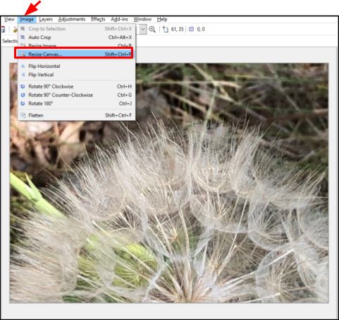
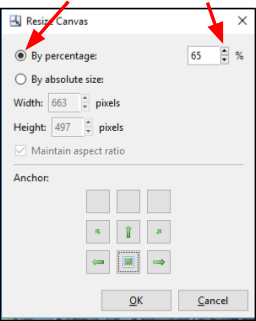
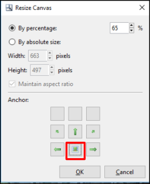

# Adjust Canvas Size 

1. Select the image from the __Image__ window to adjust the __Canvas__ size.  
  
&nbsp; 
2. Go to the **Image** Menu and select **Resize Image**.  
  
&nbsp;  
The **Resize Canvas** dialog box will pop up.  
  
&nbsp;  
3. Select from **Resize Canvas** dialog box:
    - **By Percentage**: Enter the percentage value to resize the canvas. You can also use the up and down arrows to adjust the percentage values incrementally. 
    
    &nbsp;  
    &nbsp;  
    - **By Absolute Size**: Choose this option if you know the canvas size in pixels to resize. You can select **Maintain aspect ratio** to maintain the original ratio of the canvas. You'll also need to enter the **Width** and  **Height** in pixels.  
    &nbsp;  
     Note: if **Maintain aspect ratio** was chosen, you only need to enter the **Width** or **Height** values, not both.  
    &nbsp;  
    - **Anchor**: Select the portion of the canvas that you want to use as a starting point before the resize transformation is done on the canvas.  
    &nbsp;  
    You can choose from nine anchor choices. In the example below, the bottom-middle portion of the image was selected but you can pick any of nine anchor sections from the grid. For example, if you want to include the top-right side of the image, you would select the top-right anchor.  
      
    &nbsp;  
    &nbsp;  

4. Select **OK** when you're finished and your image will be resized to the values you have specified.  
&nbsp;  
  In the following example, the **By Percentage** option was chosen and the percentage entered was **65**%. The **Anchor** position chosen was the bottom-middle portion.  

&nbsp; 
