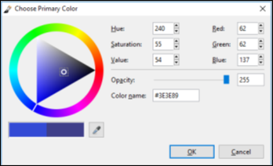
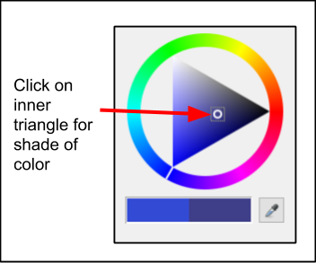

# Customize Colors
To add color to an object/text/image/layer you will need to select a primary and in some cases a secondary color.  

You can quickly select a color from the [color palette](palette.md) (left click on chosen color in palette to select primary and right click to select secondary) or in some cases you may want to choose a more customized color.

To select a customize color you can set the customized color by either using **Set Color Values** or **Select an Exact Color Match From an Image** methods.

## Set Color Values

1. Click on the *Primary Color* or *Secondary Color* boxes in the Palette. You can click the switch double arrow symbol to switch between the primary and secondary colors.

       

     The corresponding **Choose Primary Color** or **Choose Secondary** dialog boxes will then appear on your screen. 

      

    &nbsp;  
  
2. From the **Choose Primary** or **Choose Secondary** Menu you have the following options to set the color:  

    -  **Triangle Dial Selector**:

        &nbsp;
        1.  Click on the *selection marker* on the ring and drag it around to select a color
            

        &nbsp;  
        2.  Select the darkness or lightness of the ring color by clicking on a shade of the color in the inner triangle.  

        

        &nbsp;      
        

    -  **Hue**, **Saturation**, **Value**: Enter in the desired values. The triangle dial selector will move automatically to the corresponding values selected.
    -  **Red**, **Green**, **Blue**: Enter the RGB Color. The triangle dial selector will move then to the selected RGB value.
    -  **Opacity**: Enter in the value desired (0 - 255). The lower the number chosen the more translucent the color will be.
    -  **Color Name**: If you know the color name you want you can directly input the value. Entering in a number will change the RGB color and move the dial selector settings to the corresponding color. If the RGB color or the triangle dial selector was used to select a color this color name value will be updated.  
    -  **Eye Dropper**: Click on the eyedropper  and then click a color anywhere on your screen to select that color. The corresponding color values will then be displayed on the **Choose Primary Color** or **Choose Secondary Color** dialog box.  

## Select an Exact Color Match From an Image  
    
   1. Select the Color Picker tool [color picker](img/overview/pick.png) from the **Tools** menu
           .
   
   2. Left click to set the primary color and right click to set the secondary color.
   3. Drag the **Color Picker tool** across the image and click on the image color pixel you would like to capture.
 
    
 

