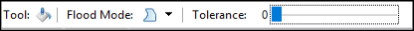
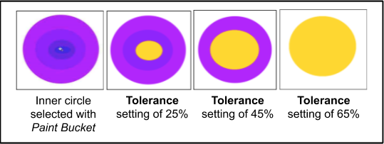

# Coloring Areas

The *Paint Bucket*  tool can be used to fill an area with a single specific color or hue. You can fill a [selected portion](select_overview.md) of the image, a simple object or text.

1. Select the *Paint bucket*  from the **Tools** menu.

    

    The paint bucket menu options will then be displayed on the *Tools Setttings Bar*.

    
    
    &nbsp;      

2.  From the paint bucket menu options:
    -  **Flood Mode**: Select **Contiguous** and the 'fill' will continue to bleed outwards from the click point until neighboring pixels fail to satisfy the Tolerance setting. Otherwise select **Global** and the 'fill' will fill all the pixels in the layer which satisfy the Tolerance setting.
    -  **Tolerance**: Select the desired level of color tolerance (0-100). A low setting means that colors must be closely matched to the clicked point pixel location for them to be filled. Whereas a higher setting means that a high variance of pixels will be included in the fill operation.
    
    &nbsp;

3.  Position the *paint bucket* cursor over the area to be filled and left click to fill the region with the [Primary color](coloring.md). Right click to fill the area with the [Secondary color](coloring.md).

    The following example with the Primary color set to yellow, shows how the setting of the **Tolerance** level can affect what region is filled with the color.

    
