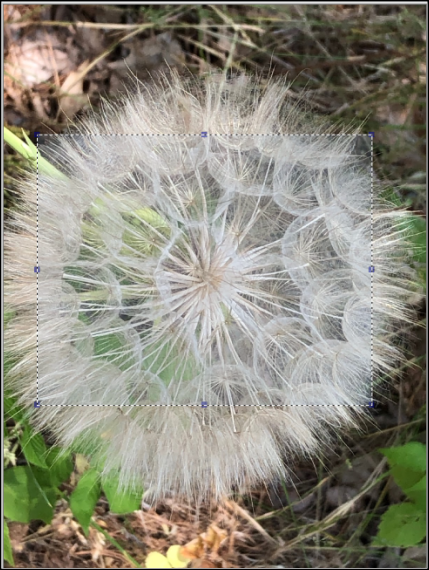
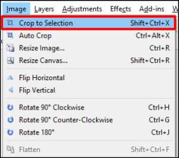
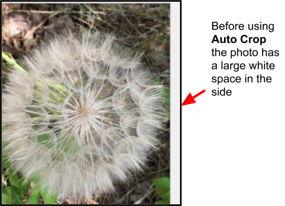
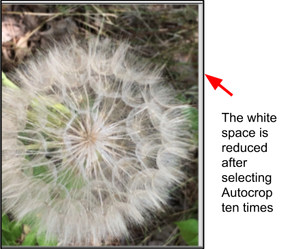

# **Crop**

You can remove unwanted outer areas from an image by cropping the image. There are two ways with Pinta that you can crop an image:

  - **Crop to Selection**: Use to remove part of the image surrounding the selection. The selected part of the image will expand to the size of the canvas. For irregular-shaped selection, such as those made by the **Lasso Select** tool, the image is cropped to a rectangular bounding box that contains the selection.
  - **Auto Crop** - Use this feature to remove small border areas from an image. For example, sometimes you may have a photo with a white border that you would like to remove and this feature enables you to remove it.

## **Crop to Selection** 

1. Select the image you want to crop from the **Images** window.  
    

    &nbsp; 
  
2. [Select part of an image you want to crop using one of the selection tools](select_overview.md).  

The following example uses the rectangle selection to select part of the image:  
    

3. Go to **Image** and select **Crop to Selection**.  
  

Here's what the example image looks like after selecting **Crop to Selection**:  
    

## **Auto Crop**

1. Select the image you want to auto crop from the **Images** window, or go to **File > Open Image File** to open up a new image from a file.  
    

    &nbsp; 
 
2. Go to **Image** and select **Auto Crop**.  
   

    &nbsp; 

3. Select **Auto Crop** from the menu a number of times to reduce the amount of border on your selected image. 

    Here's an example of an image of how Auto Crop, selected a number of times, has reduced the amount of white space on the right side of the image.  
    
    
