## __Edit Layer Properties__ ##

In the Layers Window, we work on each single layer. The layer we currently work on is called an [__active layer__](concept.md#layers). We select an active layer by clicking on the layer listed under the Layers Window to be able to edit that particular layer. You can only edit or manipulate the image that is active: no other layer will be affected or changed. A common mistake made when using layers is trying to edit an image that is not active. So keep in mind as you are learning to use Pinta that image manipulations only affect the active layer. You can always tell which image is active by looking at the selected thumbnail in the Layers Window.

Layers Window:  
  
Layers Menu:  
  
Layer Properties:  
  

### __Change Layer Name__ ###
1. Double-click the layer from the Layers Window or click on *Layer Properties...* from the Layers Menu 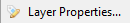.
2. Modify the name in the text box.
3. Click OK to apply the change.

### __Hide/Unhide Layers__ ###
While editing, there are moments when you need to hide a layer in order to work more efficiently on the other layers. To do so, you can hide or unhide any layers you need to view.

1. Click on the checkbox for the layer of your choice, under the Layers Window. 

### __Flipping Layers__ ###
1. Select an active layer.
2. Click on either *Flip Horizontal* or *Flip Vertical* to manipulate the whole layer to flip horizontally or vertically.  

### __Rotating Layers__ ###
1. Select an active layer.
2. Click on *Rotate / Zoom Layer...*.  
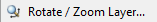
3. Use the angle slider or type in an angle degree number to select the degree of rotation.  

4. Click OK to apply the change.

### __Change Layer Opacity__ ###
1. Double-click the layer from the Layers Window or click on *Layer Properties...* from the Layers Menu .
2. Use the slider or enter in the percentage of your choice.
3. Click OK to apply the change.

### __Apply Blend Mode__ ###
A layer's blend mode specifies how it is blended with the layers immediately below it in the layer stack.  Changing the Blend Mode on a single layer can radically alter the composite image. The order of the layers in the layers stack is important when using layer blend modes. Layer A blended over Layer B is not the same as Layer B blended over Layer A - even if the same blend mode is used.

1. Double-click the layer from the Layers Window or click on *Layer Properties...* from the Layers Menu .
2. Use the drop-down to select the style of blend mode.
3. Click OK to apply the change.

The Blend Mode drop-down list offers 14 blend modes. We'll be using two images for the blend mode examples: background and a top layer.

Background:  
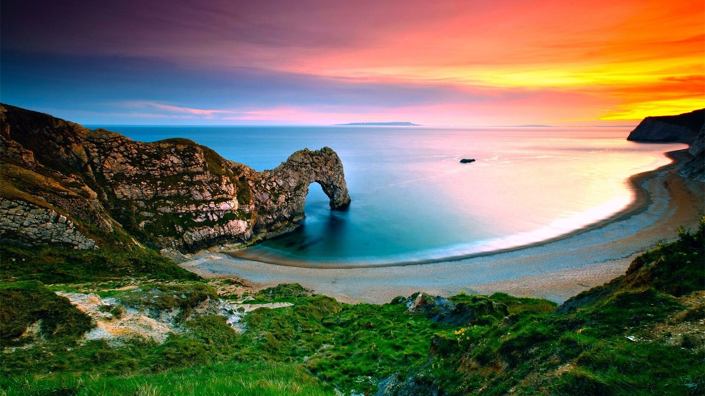  
Top Layer:  

#### Normal ####

This is the default and standard blend mode. Each pixel in the layer is blended with the composition depending on its alpha value.  
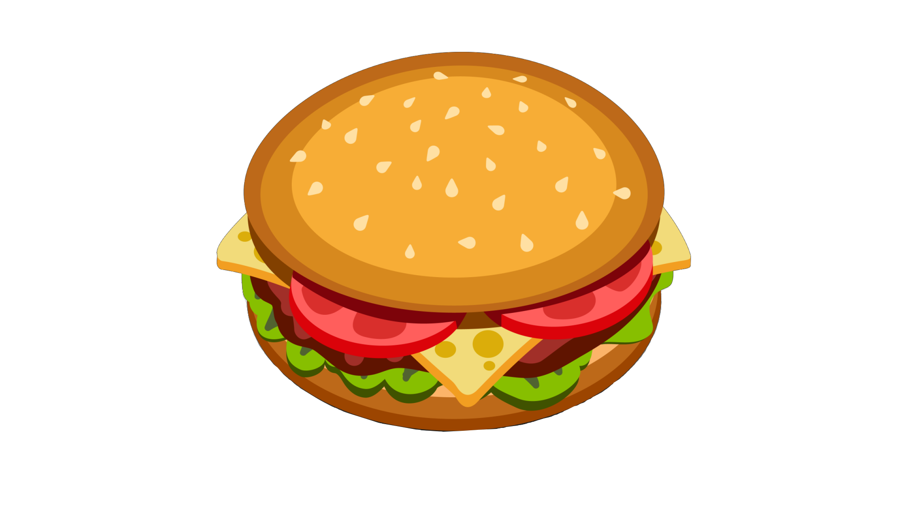

#### Multiply ####

Each pixel's RGB component intensity is multiplied with the pixel value from the composition. The result of this blend mode is always darker than the original.  White pixels in the blend layer are effectively rendered transparent by the Multiply blend.  
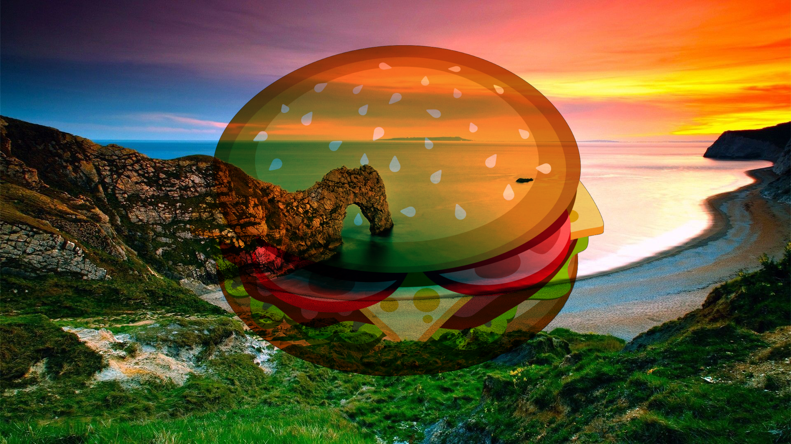

#### Additive ####

Each pixel's RGB component intensity is added to the intensity of the pixel values from the composition.  The Additive blend has the effect of brightening pixels in the final composition. Black pixels in the blend layer are rendered as transparent by the Additive blend.  
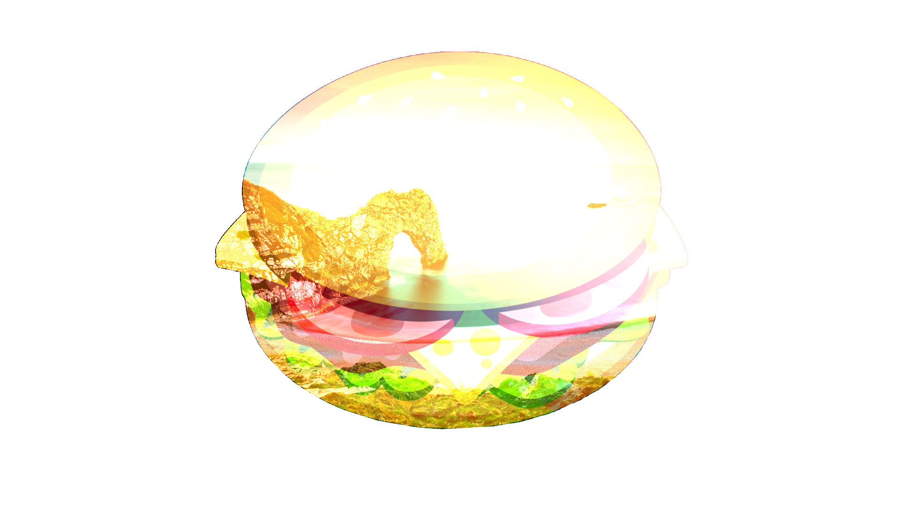

#### Color Burn ####

This blend mode has the effect of making dark pixels darker while lighter pixels must be blended with other light-colored pixels in order to remain bright.  
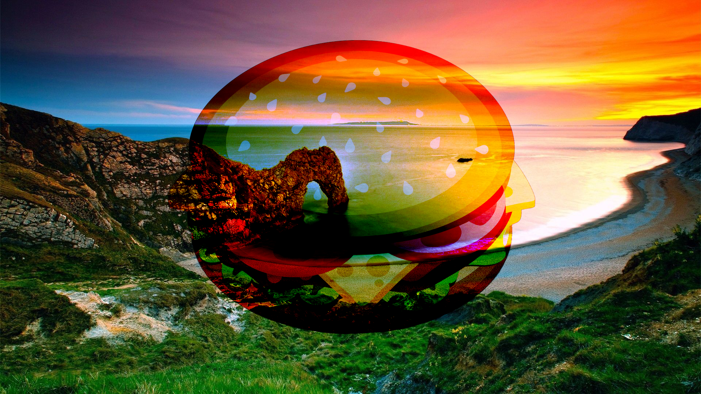

#### Color Dodge ####

This can be thought of as the opposite of Color Burn. Lighter pixels retain their brightness while darker pixels must be blended with other dark pixels in order to remain dark.  
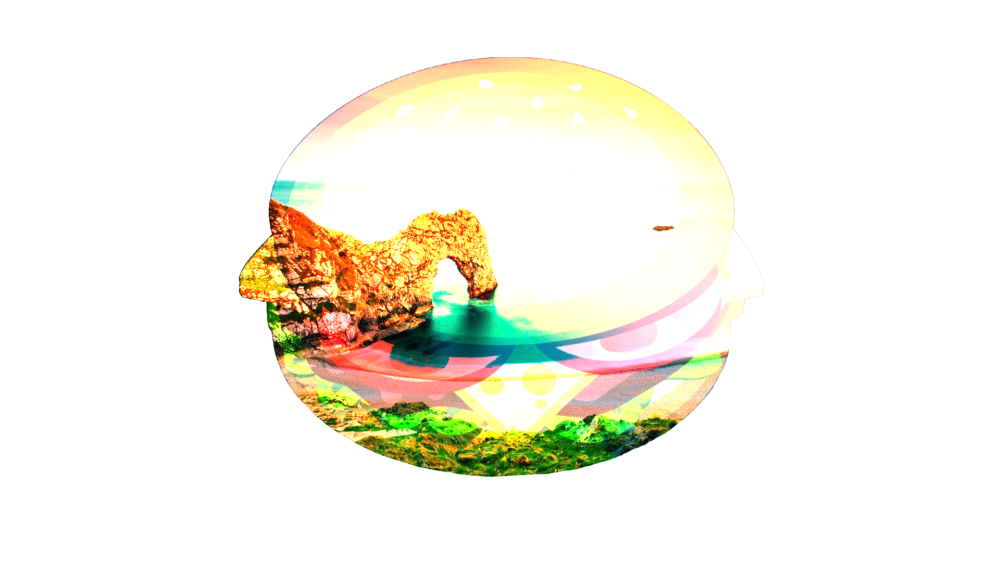

#### Reflect ####

This blend mode can be used for adding shiny objects or areas of light. Black pixels in the blend layer are ignored as if they were transparent.  

#### Glow ####

This is the reverse of the Reflect mode: it works the same as swapping the layer positions and using Reflect. Glow effectively brightens the composition by the amount of brightness in the blend layer. Black pixels in the blend layer are rendered as if they were transparent.  
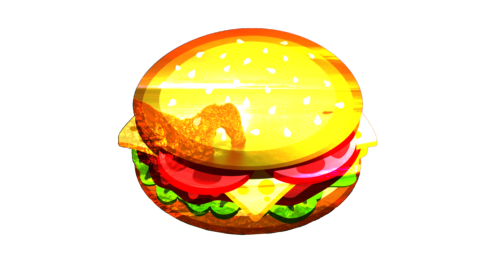

#### Overlay ####

This is a combination of Screen and Multiply modes which uses the blend pixel intensity to determine the result.  For darker colors, this acts like Multiply. For lighter colors, this acts like Screen.  

#### Difference ####

The counterpart to Additive blending. The layer pixel's intensity is subtracted from the composition pixel's intensity resulting in darker colors.  Subtraction could produce a negative intensity which is unable to be displayed, so an absolute value is returned.  Thus, both "white minus black" and "black minus white" will both produce white. Difference blend is often useful when using the Clouds effect.  

#### Negation ####

At first glance this seems similar to Difference, however it actually produces the opposite effect.  Instead of making colors darker, it will make them brighter.  
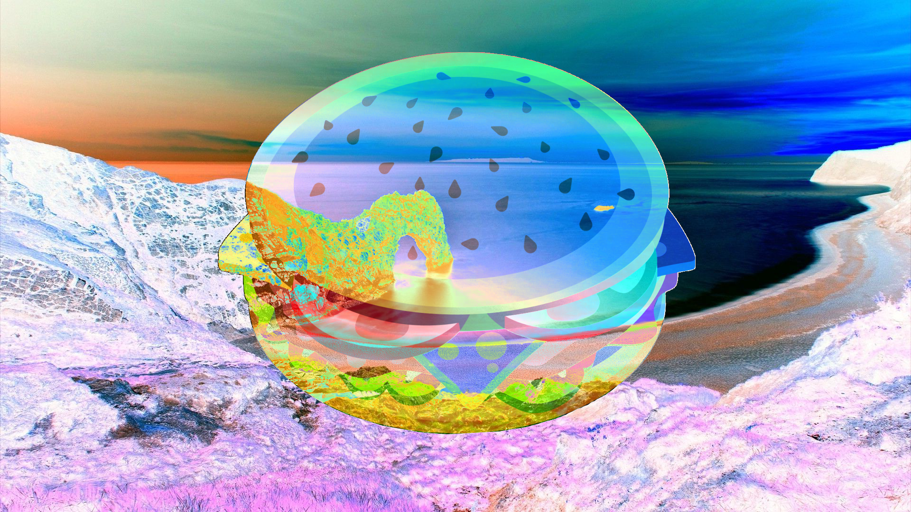

#### Lighten ####

The lightest pixel of either the blend layer or the composition is used.  
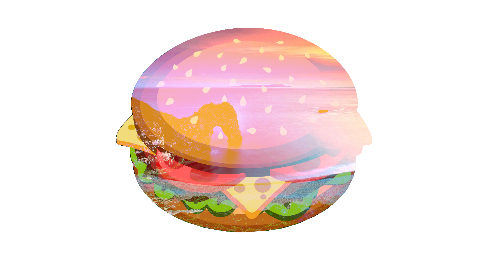

#### Darken ####

The darkest pixel of either the blend layer or the composition is used.  
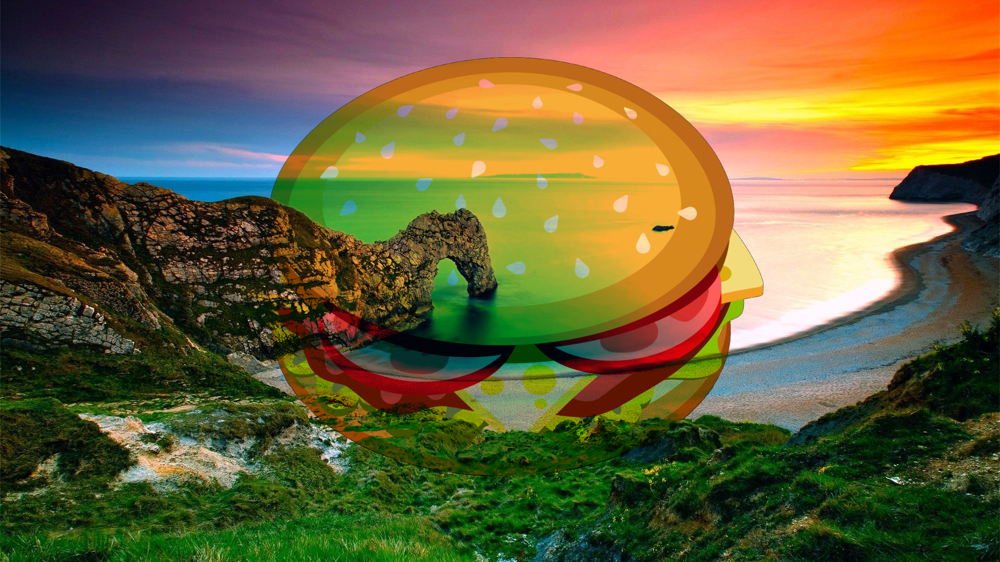

#### Screen ####

This can be thought of as the opposite of the Multiply blend mode. It is used to make pixels brighter, with black being effectively transparent.  

#### Xor ####

This is short for "exclusive OR", which is an advanced blending mode that is primarily used for image analysis.  Pixels in the blend layer which exactly match the composition will be rendered black. Where differences exist, colors are shown.  

