## __Image Effects__ ##
Pinta offers a wide range of effects that can be applied to images or selected areas of an image.

* [__Glow__](#glow): use to overlay an illuminating glow as if the image were strongly backlit
* [__Sharpen__](#sharpen): use to sharpen the image by removing softness
* [__Soften Portrait__](#soften-portrait): use to make the portrait lighting appear more diffused
* [__Blur__](#blur): use to make the image appear blurred
* [__Distort__](#distort): use to warp, twist, transform or convolute an image.
* [__Artistic Medium__](#artistic-medium): use to make the image appear as if it were painted or sketched
* [__Render__](#render): use to render clouds or fractals
* [__Stylize__](#stylize): use to change the image based on edge detection
     
     
     
All of the effects can be found in the effects menu:

To illustrate all of the effects we will be using this photo of KFC.

### Glow: ###

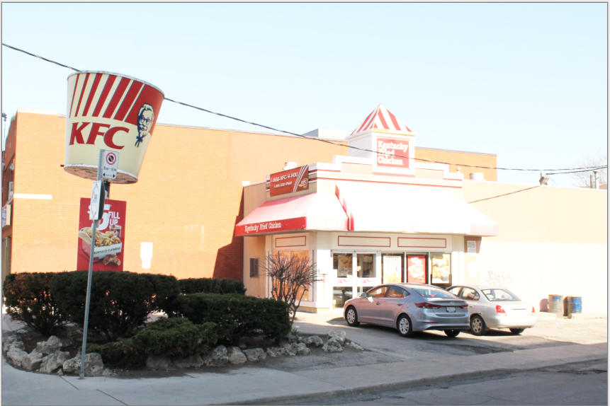

The **Glow** effect is used to give images an inner glow by brightening lighter tones and muting color saturation, making the image appear as though it were strongly back-lit. A dialog box populates with three sliders, radius, brightness, and contrast.

1. Go to **Effects** > **Photo** and select **Glow**. The **Glow** dialogue box will then appear.

    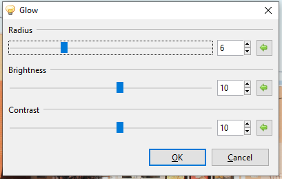

2. Adjust the **Radius** slider to control the strength of the effect. Higher values yield stronger effect results.

   * Drag slider to the right to increase effect strength
   * Drag slider to the left to decrease effect strength

3. Adjust the **Brightness** slider to control the intensity of the illumination. Higher values yield brighter images, lower values yield darker images.

   * Drag slider to the right to increase brightness
   * Drag slider to the left to decrease brightness

4. Adjust the **Contrast** slider to control the color range, making an image appear more vivid or dull. Higher contrast values yield more vibrant tones and lower values yield duller tones.

   * Drag slider to the right to increase contrast
   * Drag slider to the left to decrease contrast

### Sharpen: ###

  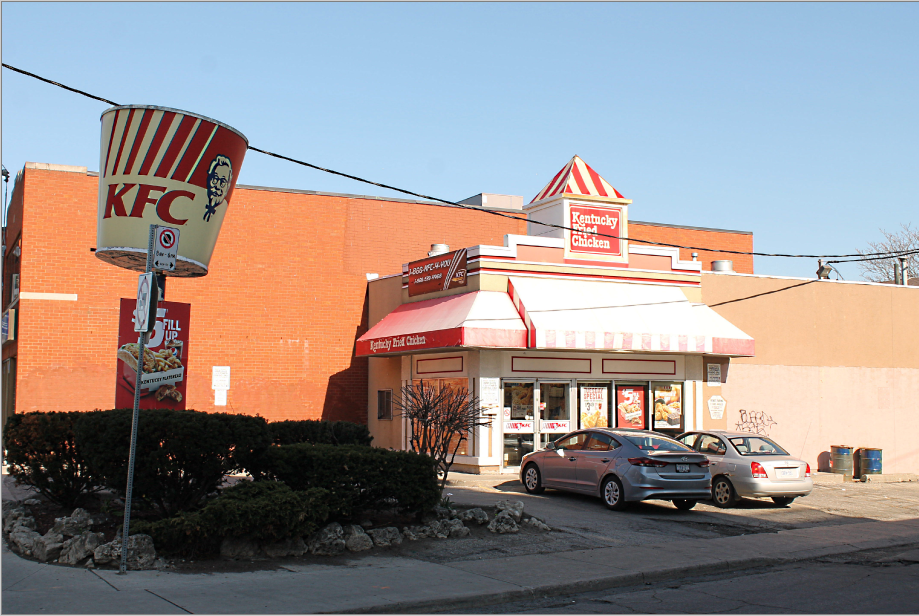

The **Sharpen** effect is used to reduce softness and emphasize texture in an image to draw in viewer focus. A dialog box populates with a strength slider. The strength slider controls how pronounced the edges in an image appear, increasing the contrast of edges. 

 1. Go to **Effects** > **Photo** and select **Sharpen**. The **Sharpen** dialogue box will then appear. 

    

2. Adjust the Sharpness **Amount** to control how sharp the image appears. 

  * Drag slider to the right to increase sharpness
  * Drag slider to the left to decrease sharpness

### Soften Portrait: 

The **Soften Portrait** effect is used to soften images as if the lighting were diffused, adding a subtle glow. 

 1. Go to **Effects** > **Photo** and select **Soften Portrait**. The **Soften Portrait** dialogue box will then appear.  
 
   

2. Adjust the **Softness** slider to control the strength of the effect. Higher values yield a softer, more blurred image. 

  * Drag slider to the right to increase softness
  * Drag slider to the left to decrease softness

3. Adjust the **Lighting** slider to control the strength of the illumination. Higher values yield stronger lighting and brighter images. 

  * Drag slider to the right to increase lighting
  * Drag slider to the left to decrease lighting
 

4. Adjust the **Warmth** slider to control the color of the lighting. Higher values yield more warmth, making tones appear more golden. Lower values yield more coolness, making tones appear bluer.

  * Drag slider to the right to increase warmth
  * Drag slider to the left to decrease warmth

Here's is the image before and after using the Soften Portrait effect:

     

### Blur: ###

There are six **Blur** effect options: [**Fragment**](effects.md#fragment), [**Gaussian**](effects.md#gaussian), [**Motion**](effects.md#motion), [**Radial**](effects.md#radial), [**Unfocus**](effects.md#unfocus), and [**Zoom**](effects.md#zoom). These can be applied to the whole image or a selected area.

#### Fragment ####

The **Fragment** blur effect superimposes copies or “fragments” of the image or selected area. Copies or "fragments" of the image are superimposed over the original. This blur can be useful when creating an unfocussed multi-viewed version of an image. The effect is not unlike modern interpretations of insect-like vision and could be used to fake "drunken" or "semi-conscious" vision. 

1. Go to **Effects** > **Blur** and select **Fragment**. The **Fragment** dialogue box will then appear.

   

2. Adjust the **Fragments** slider to control how many fragments appear. A higher value yields more fragments.

  * Drag slider to the right to increase number of fragments
  * Drag slider to the left to decrease number of fragments
     
3. Adjust the **Distance** slider to control how close or far fragments appear from one another. A higher value yields more distance between fragments.

  * Drag slider to the right to increase distance
  * Drag slider to the left to decrease distance
     
4. Adjust the **Rotation** circle slider to control the angle at which the fragments sit. It can be rotated 360 degrees. 

#### Gaussian ####

The **Gaussian Blur** effect applies a defocusing blur to the image or selected area.

1. Go to **Effects** > **Blur** and select **Gaussian**. The **Gaussian** dialogue box will then appear.

   

2. Adjust the **Radius** slider to control how widely and how strongly the blur is applied. A higher value yields a stronger effect.

  * Drag slider to the right to increase blur strength
  * Drag slider to the left to decrease blur strength

#### Motion ####

The **Motion Blur** effect creates the illusion of motion in an image or selected area. A dialog box populates with two sliders, for angle and distance.

1. Go to **Effects** > **Blur** and select **Motion**. The **Motion** dialogue box will then appear. 

   

2. Adjust the **Angle** circle slider to control the angle at which the motion blur appears It can be rotated 360 degrees.

3. Adjust the **Distance** slider to control the width of the blur, how far the effect shifts the original pixels. A higher value yields a wider effect.

* Drag slider to the right to increase motion blur effect
* Drag slider to the left to decrease motion blur effect. 

#### Radial ####

The **Radial Blur** effect is like the motion blur, but rather than following a linear path, it follows a circular one. 

 1. Go to **Effects** > **Blur** and select **Radial Blur**. The **Radial Blur** dialogue box will then appear. 
 
    

2. Adjust the **Angle** circle slider to control the angle at which the blur appears It can be rotated 360 degrees.

3. Adjust the **Center** option box to configure where the effect will be interpreted from, setting the focus or center of the blur. 

4. Adjust the **Quality** slider to define the quality of the blur. A higher value yields higher quality. It is recommended to use low quality for previews, small images, and small angles. High quality should be used for final quality, large images, and large angles. 

  * Drag slider to the right to increase quality
  * Drag slider to the left to decrease quality 

#### Unfocus ####

The **Unfocus Blur** effect is like the Gaussian blur but yields a more dreamy or unfocused look to the image or selected area. 

 1. Go to **Effects** > **Blur** and select **Unfocus**. The **Unfocus** dialogue box will then appear. 
 
    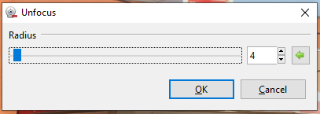

2. Adjust the **Radius** slider to control the strength of the effect. A higher value yields a stronger blur effect. 

  * Drag slider to the right to increase blur strength
  * Drag slider to the left to decrease blur strength  

#### Zoom ####

The **Zoom Blur** effect is used to give the appearance of motion towards the focal point of an image, as if the viewer were closing in on the focal point. It is like the Motion blur but applied outwards from a central point. 

1. Go to **Effects** > **Blur** and select **Zoom Blur**. The **Zoom Blur** dialogue box will then appear.  

   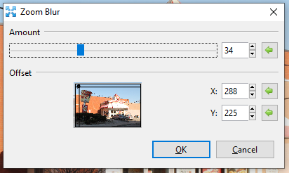

2. Adjust the **Amount** slider to control how strong the blur appears. A higher value yields a stronger effect. 

  * Drag slider to the right to increase blur strength
  * Drag slider to the left to decrease blur strength  

3. Adjust the **Offset** option box to configure where the effect will be interpreted from, setting the focus or center of the blur. 

### Distort: ###
There are six **Distort** options: [**Bulge**](effects.md#bulge, [**Frosted Glass**](effects.md#frosted-glass), [**Pixelate**](effects.md#pixelate), [**Polar Inversion**](effects.md#polar-inversion) [**Tile Reflection**](effects.md#tile-reflection), and [**Twist**](effects.md#twist). These can be applied to the whole image or a selected area.

#### Bulge ####

The **Bulge** effect makes the image or selected area swell or shrink, similar to a fisheye or reverse fisheye effect. 

1. Go to **Effects** > **Distort** and select **Bulge**. The **Bulge** dialogue box will then appear. 

   

2. Adjust the **Amount** slider to control how strong the swelling or shrinking appears. A higher value yields a stronger effect. 

* Drag slider to the right to increase swelling
* Drag slider to the left to decrease swelling 

3. Adjust the **Offset** option box to configure where the effect will be interpreted from, setting the focus or center of the bulge. 

#### Frosted Glass ####

The **Frosted Glass** effect makes the image or selected area look as though it were being viewed through frosted glass. 

1. Go to **Effects** > **Distorted** and select **Frosted Glass**. The **Frosted Glass** dialogue box will then appear. 

   

2. Adjust the **Amount** slider to control the harshness and number of displaced pixels giving off the frosted effect. A higher value yields a more frosted, pixelated look. 

* Drag slider to the right to increase frosted appearance
* Drag slider to the left to decrease frosted appearance 

#### Pixelate ####

The **Pixelate** effect gives the image or selected area a pixelated look, reducing detail by enlarging regularly sampled pixels. 

1. Go to **Effects** > **Distorted** and select **Pixelate**. The **Pixelate** dialogue box will then appear. 

   

2. Adjust the **Cell Size** slider to control the size of the pixels. A higher value yields larger pixels, and lower values yield smaller, finer pixels. 

* Drag slider to the right to increase pixel size
* Drag slider to the left to decrease pixel size 

#### Polar Inversion ####

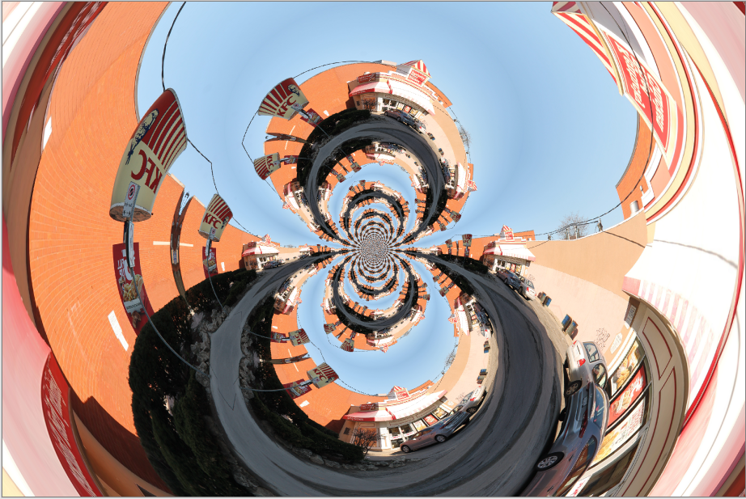

The **Polar Inversion** effect applies a transformation between Cartesian and Polar coordinate systems, resulting in a positional transformation which recursively wraps the image around itself in an endlessly repeating pattern.  

1. Go to **Effects** > **Distorted** and select **Polar Inversion**. The **Polar Inversion** dialogue box will then appear.

   

2. Adjust the **Amount** slider to control the strength of the effect. A higher value yields a stronger inversion.

* Drag slider to the right to increase strength
* Drag slider to the left to decrease strength 

3. Adjust the **Offset** option box to configure where the effect will be interpreted from, setting the focus or center of the inversion. 

The **Edge Behavior** dropdown selection defines how the effect behaves as the transformation reaches then exceeds the edge of the canvas.

#### Tile Reflection ####

The **Tile Reflection** effect makes the image or selection appear as if it were reflected in a wall of mirrored tiles. 

1. Go to **Effects** > **Distorted** and select **Tile Reflection**. The **Tile Reflection** dialogue box will then appear. 
   

2. Adjust **Rotation** circle slider controls the angle at which the tiles appear. It can be rotated 360 degrees.

3. Adjust **Tile Size** slider to control how big or how small the tiles appear, they always remain square. A higher value yields larger tiles.

* Drag slider to the right to increase tile size
* Drag slider to the left to decrease tile size

4. Adjust **Intensity** slider to control the curvature of each tile, determining how much of the surrounding are reflected in each tile. A higher value yields curvier tiles, making the image appear more abstracted. 

* Drag slider to the right to increase tile curvature
* Drag slider to the left to decrease tile curvature 

#### Twist ####

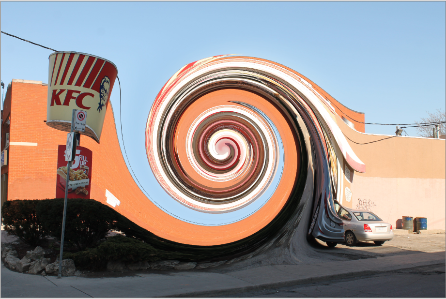

The **Twist** effect mimics winding the image around the center point of the image. 

1. Go to **Effects** > **Distorted** and select **Twist**. The **Twist** dialogue box will then appear.  
   

2. Adjust the **Amount** slider to control the intensity of the twist. Numbers closer to 0 make the effect less intense, with 0 leaving the image unaltered.

3. Adjust the **Antialias** slider to control the amount of detail. A higher value yields a smoother appearance, while lower values yield a more jagged, pixelated appearance. 

* Drag slider to the right to increase smoothness
* Drag slider to the left to decrease smoothness

### Artistic Medium: ###

There are 3 **Artistic Medium** options: [**Ink Sketch**](effects.md#ink-sketch), [**Oil Painting**](effects.md#oil-painting), and [**Pencil Sketch**](effects.md#pencill-sketch), all mimicking traditional artistic mediums. 

##### Ink Sketch ####

The **Ink Sketch** effect makes the image appear as if it were drawn using a pen. 

1. Go to **Effects** > **Artistic** and select **Ink Sketch**. The **Ink Sketch** dialogue box will then appear. 
   

2. Adjust the **Ink Outline** slider to control the weight of the outline or edging. 

* Drag slider to the right to increase outline strength
* Drag slider to the left to decrease outline strength

3. Adjust the **Coloring** slider to control how much of the original image’s color bleeds through, higher values yield higher saturation.

* Drag slider to the right to increase color
* Drag slider to the left to decrease color

##### Oil Painting ####

The **Oil Painting** effect makes the image appears as if it were painted with oil paints. 

1. Go to **Effects** > **Artistic** and select **Oil Painting**. The **Oil Painting** dialogue box will then appear. 
   

2. Adjust the **Brush Size** slider to control the size of the paintbrush tip, larger values yield larger strokes and smaller values yield finer strokes.

* Drag slider to the right to increase brush size
* Drag slider to the left to decrease brush size

3. Adjust the **Coarseness** slider to control how much detail is captured in the transformation. A larger value yields a more detailed oil painting render and a smaller value yields a less detailed oil painting render. 

* Drag slider to the right to increase detail
* Drag slider to the left to decrease detail

##### Pencil Sketch ####

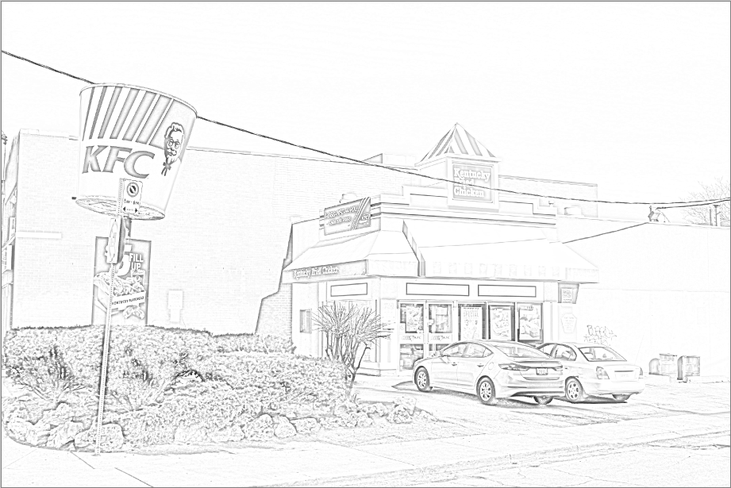

The **Pencil Sketch** effect makes the image appear as though it were sketched with a pencil. 

1. Go to **Effects** > **Artistic** and select **Pencil**. The **Pencil** dialogue box will then appear. 
   

2. Adjust the **Pencil Tip** slider to control the sharpness of the virtual pencil. A larger value yields a blunter tip, making lines thicker and heavier. A smaller value yields a sharper tip, making lines finer, and the image appear lighter. 

* Drag slider to the right to increase line thickness
* Drag slider to the left to decrease line thickness

_The **Color Range** slider has no effect on the image as it’s generated in greyscale. This slider is arbitrary and can be ignored._ 

### Render: ###

There are 3 **Render** options: [**Clouds**](effects.md#clouds), [**Julia Fractal**](effects.md#julia-fractal), and [**Mandelbrot Fractal**](effects.md#madelbrot-fractal), these three effects create completely new renderings, replacing all color information in the active layer or selection. 

##### Clouds ####

The **Clouds** effect renders a randomized cloud pattern to the layer or desired selection. 

1. Go to **Effects** > **Render** and select **Clouds**. The **Cloud** dialogue box will then appear. 
   

2. Adjust the **Scale** slider to control the size of clouds. Higher values yield larger clouds and lower values yield finer clouds. 

* Drag slider to the right to increase cloud size
* Drag slider to the left to decrease cloud size

3. Adjust tThe **Power** slider to control how coarse or how fluffy the clouds appear, dealing with their texture. Higher values yield coarser, more detailed clouds and lower values yield softer, more blurred clouds.

* Drag slider to the right to increase cloud texture
* Drag slider to the left to decrease cloud texture

4. Select a **Blend Mode** from dropdown menu to configure how the rendered clouds will be blended with the original image or layer.

See a full list of blend modes and their deciprtions in the [Image Layers menu](edit.md#apply-blend-mode)

* The **Reseed** button randomizes the cloud pattern. 

* The **Coloring** of the rendered clouds depends on the two colors selected in the color palette. To render clouds as a single color, lower the secondary color’s opacity to 0 in the color selection menu. 

#### Julia Fractal ####

The **Julia Fractal** effect renders a Julia Fractal on the layer or desired selection.

1. Go to **Effects** > **Render** and select **Julia Fractal**. The **Julia Fractal** dialogue box will then appear. 
   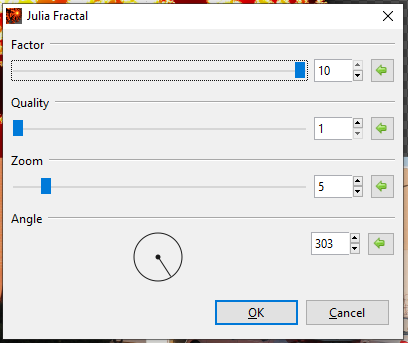

2. Adjust the **Factor** slider to control the color saturation. Higher values yield more vivid colors and lower values yield duller colors, with 1 rendering a greyscale fractal. 

* Drag slider to the right to increase saturation
* Drag slider to the left to decrease saturation

3. Adjust the **Quality** slider to control the amount of detail in the fractal. Higher values yield a smoother, more detailed fractal and lower values yield a more jagged, “pixelated” fractal. 

* Drag slider to the right to increase fractal detail
* Drag slider to the left to decrease fractal detail

4. Adjust the **Zoom** slider to control the scale, allowing you to zoom in or out. 

* Drag slider to the right to zoom in
* Drag slider to the left to zoom out

5. Adjust the **Angle** circle slider to control the angle at which the fractal sits. It can be rotated 360 degrees. 

#### Mandelbrot Fractal ####

The **Mandelbrot Fractal** effect renders a Mandelbrot Fractal on the layer or desired selection.

1. Go to **Effects** > **Render** and select **Mandelbrot Fractal**. The **Mandelbrot Fractal** dialogue box will then appear. 
   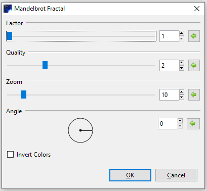

* The colors of this fractal are not configurable but can be inverted. Checking the ☑ Invert Colors checkbox has the same effect as applying **Adjustments > Invert Colors.** 
 
2. Adjust the **Factor** slider to control the color saturation. Higher values yield more vivid colors and lower values yield duller colors, with 1 rendering a greyscale fractal. 

* Drag slider to the right to increase saturation
* Drag slider to the left to decrease saturation

3. Adjust the **Quality** slider to control the amount of detail in the fractal. Higher values yield a smoother, more detailed fractal and lower values yield a more jagged, “pixelated” fractal. 

* Drag slider to the right to increase fractal detail
* Drag slider to the left to decrease fractal detail

4. Adjust the **Zoom** slider to control the scale, allowing you to zoom in or out. 

* Drag slider to the right to zoom in
* Drag slider to the left to zoom out

5. Adjust the **Angle** circle slider to control the angle at which the fractal sits. It can be rotated 360 degrees. 

### Stylize:

The Stylize menu is made up of four options: [**Edge Detect**](effects.md#edge-detect), [**Emboss**](effects.md#emboss), [**Outline**](effects.md#outline), and [**Relief**](effects.md#relief) to change the image or selected area based on edge detection.
     
#### Edge Detect ####

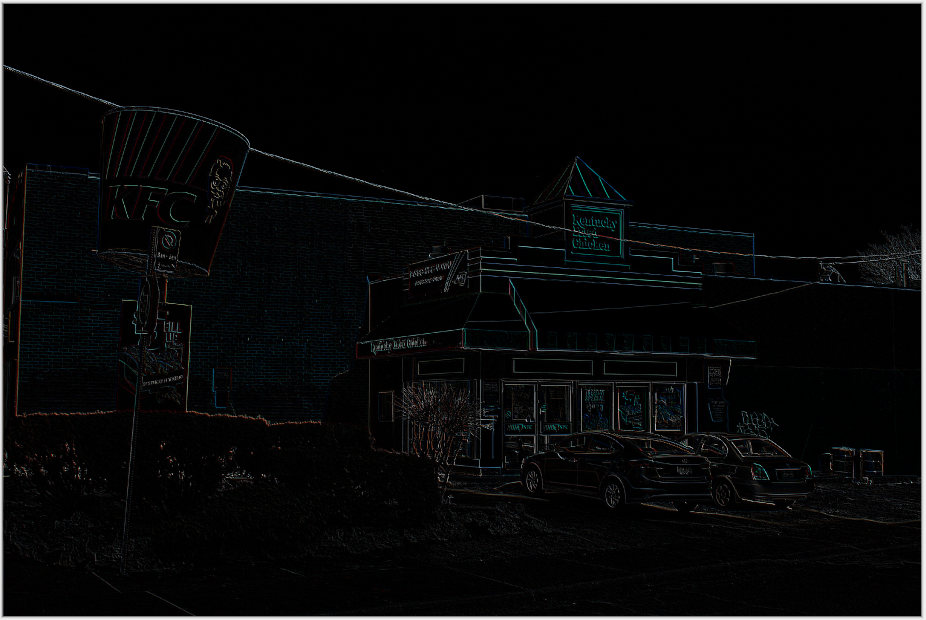

The **Edge Detect** effect highlights the edges of an image or selected area, creating an almost embossed effect.

1. Go to **Effects** > **Stylize** and select **Edge Detect**. The **Edge Detect** dialogue box will then appear. 
   

2. Adjust the **Angle** circle slider to control the angle at which the edges appear, controlling the direction of the light source. It can be rotated 360 degrees.

#### Emboss ####

The **Emboss** effect is similar to the edge effect. It generates a black and white rendering of the image where the edges have been given a 3D highlight as though they were physically embossed. 

1. Go to **Effects** > **Stylize** and select **Emboss**. The **Emboss** dialogue box will then appear. 
   

2. Adjust the **Angle** circle slider to control the angle at which the edges appear, controlling the direction of the light source. It can be rotated 360 degrees.

#### Outline ####

The **Outline** effect enhances edges found in an image by tracing around them with an outline of requested radius.

1. Go to **Effects** > **Stylize** and select **Outline**. The **Outline** dialogue box will then appear. 

   

2. Adjust the **Thickness** slider to control how thick the outline appears. Higher values yield thicker outlines and lower values yield finer outline.

* Drag slider to the right to increase thickness
* Drag slider to the left to decrease thickness

3. Adjust the **Intensity** slider to control the strength of the effect, or the number of pixels that the effect is applied to. Higher values yield a stronger effect. 

* Drag slider to the right to increase intensity
* Drag slider to the left to decrease intensity

#### Relief ####

The **Relief** effect is similar to the edge detect effect, but instead it blends the raised edges back into the original image, giving it a full colored embossed look. A dialog box populates with a circle slider for the angle. 

1. Go to **Effects** > **Stylize** and select **Relief**. The **Relief** dialogue box will then appear. 

   

2. Adjust the **Angle** circle slider to control the angle at which the edges appear, controlling the direction of the light source. It can be rotated 360 degrees.

