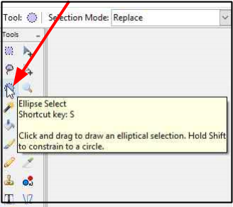

# Ellipse Select
The Ellipse Select Tool can be used for elliptical (including circular) selections. For example, you can use it to select rounded objects such as balls. 

## How to use the Ellipse Selection Tool
1. Select the *Ellipse Selection* tool  from the **Tools** menu options.

       

    &nbsp;

2. Position the *Ellipse Selection* tool to the top left hand corner (**A**) portion of the area that you want to select.

      

    &nbsp;

3. Click and hold the right mouse button while you drag the crosshair mark to the right hand bottom corner (**B**) of your desired element. While you drag, the ellipse dotted line selection shape appears. Pressing the **`Shift`** key after starting the selection and holding it down until you are finished will constaint the selection into a circle. 
 
      

     &nbsp;

 4. Release the mouse button (and **`Shift`** if it was pressed) once you have captured the elliptical region you want to select.   
     

