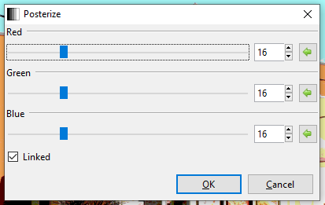

# Filters Overview
Pinta offers a wide variety of filters that can be applied to your image/photograph, or to an isolated area using any one of the [**selection tools.**](select_overview.md)

All of the filters can be found in the adjustment menu:

We will be using this photo of KFC to demonstrate the filters. 

Pinta provides the following filters found in the **Adjustments** dropdown:

#### Sepia

To apply the Sepia filter go to **Adjustments** > **Sepia**

The **Sepia** adjustment gives images an aged photograph look. It renders the image in black and white and adds a sepia tone. It does not have any configurable options. 

#### Posterize

To apply the Sepia filter go to **Adjustments** > **Posterize**

The **Posterize** adjustment reduces the number of color values that each pixel uses, giving the image a “posterized” effect. A dialogue box with 3 sliders, one for red, one for green, and one for blue will appear. 

Each RGB (Red, Green, Blue) color channel has 256 possible values, the sliders let you adjust the range from 2 to 64. The lower the number, the less color value each pixel uses.

* If the ☐ Linked checkbox is unchecked, you can adjust each color channel independently
* If the ☑ Linked checkbox is checked, all color channels will follow the same value

#### Black and White

To apply the Back and White filter go to **Adjustments** > **Black and White**

The **Black and White** adjustment strips the image of all color information, desaturating it, and it renders it in greyscale. The image will be made up of only black, white, and greyscale. It does not have any configurable options. 

#### Invert Colors

To apply the Invert Colors filter go to **Adjustments** > **Invert Colors**

The **Invert Colors** adjustment is the digital equivalent of a negative, the tones are inverted so that black becomes white and vice versa. If applied a second time, the image reverts to its original colors. It does not have any configurable options. 

