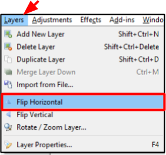

# Flip

 You can rotate an image by using:  

 -  [**Flip Selecting Layers**](rotate.md#rotate_image_preset_degrees)
 -  [**Flip Selecting Image**](rotate.md#rotate_layer_specified_degrees)

## Flip Selecting Layers

1. Select the layer you want to flip from the *Layer Window*.  

       

    &nbsp; 
 
  
2. Go to the **Layers** Menu and select either **Flip Horizontal** or **Flip Vertical**.

       
  
&nbsp;  
3. Check that the image has flipped to your desire location. If you would like to unflip the image use the [undo function](concept.md). 

## Flip Selecting Image 

1.  Select the image that you would like to flip from the *Image Window*.

       

    &nbsp; 
 
  
2. Go to the **Image** Menu and select **Flip Horizontal** or **Flip Verticale**.

       
 
&nbsp;  
3. Check that the image has flipped to your desire location. If you would like to unflip the image use the [undo function](concept.md). 

 

  
