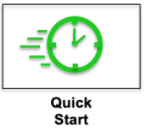
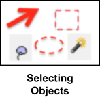
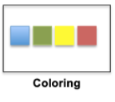
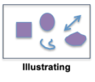
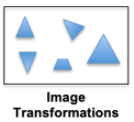
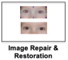
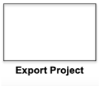
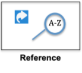
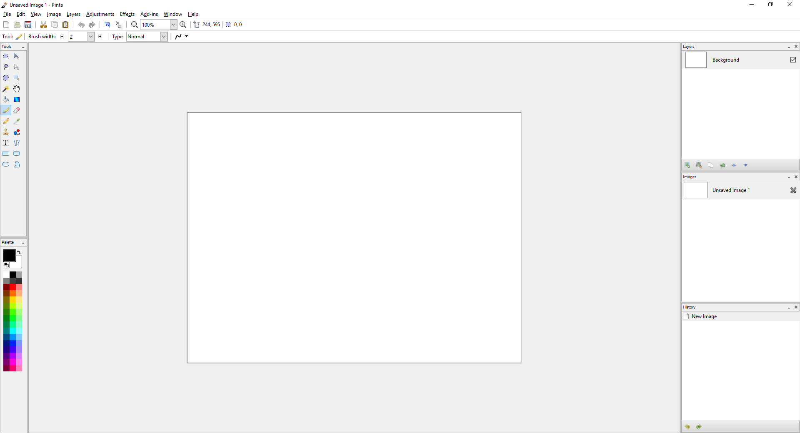

# __Welcome to our Pinta Project User Guide__ #
This user guide was developed to help you speed up your learning curve for Pinta. Whether you have used Pinta in the past and want to learn new features or are just getting started this user guide is for you! This guide covers how to use Pinta for simple to intermediate level projects and photo edits. It details how to use basic features ranging from drawing, resizing, and rotating images to more advanced projects like posters, graphics, and professional-level photo editing and effects. To follow are some quick icon button links to the sections of this user guide. However you can also use the left navigation menu or the search function at the top of the page to find topics of interest. Following these quick link icon buttons there is an overview [**about**](index.md#about) Pinta and some [**help**](index.md#help) resources to refer to beyond this guide. 

          

## __About__ ##

__*Pinta Project: Painting Made Simple*__

Pinta is a free, open-source drawing application with a versatile range of uses. It can be used as a basic graphics editor or paint tool similar to MS Paint and Paintbrush for Mac. While Pinta is not as feature rich as some pay per use software such as Photoshop, however, it does work with a design layered approach (unlike other free bitmap editors) and can be used to draw, colour and edit pictures (including digital camera photos and screenshots). For example, using a screen shot from a display, one can modify the image to include arrows pointing to specific parts of the image. 

Some of the main feature benefits of free Pinta software include: 

 -  Multiple operating system support (Linux, Windows and Mac OS X)  
 -  Layers system (most simple bitmap editors do not have this capability).  This feature is available in programs like Photoshop and GIMP but Pinta’s system is more user friendly for intermediate level users. Layers help separate and group elements of an image for easy editing.  
 -  Full history (always easy to go back) enabling users to not be afraid to experiment as you can always use the undo feature.  
 -  Customizable workspace  
 -  Multiple language support  
 - Write add-ins capability ( i.e. can write a custom brush)  
 - More features than basic image drawing/photo editing packages like Paint ( Pinta has over 35 adjustments and effects for editing images) but simpler than more advanced pay-per-use software like Photoshop.  

Originally created and maintained by Jonathan Pobst (until version 1.0), a new has community took over the project for the community.

If you would like more information about the background of Pinta and of the Pinta community go to the Pinta-project.com website which includes the following information:

 - The history of the Pinta Project
 - How to contribute to the Pinta Project
 - Reporting Bugs & Feature Requests
 - Pinta Contacts

