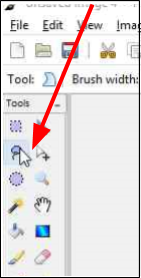
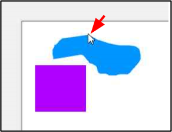

# Lasso Select
The Lasso selection tool comes in handy when you may want to select a part of an image that is not perfectly rectangular or elliptical. The Lasso selection tool can be used to draw a free-form border around a selected object within an image. 

## How to Use the Lasso 

1. Select the Lasso Tool  from the Tool Menu options.   

       

    &nbsp; 
  
2. Position the cursor on the edge of the element that you want to select and then click and hold the mouse button. 

      

    &nbsp;

3. Trace around the element while continuing to not release the mouse button and try to capture only what you want to retain in your selection. While you trace, a dotted line forms that follows the movement of your mouse. Continue to trace the selection and return to the starting point to close the loop.

      

    &nbsp;

4. Release the mouse button and Pinta will close the selection. If you did not trace fully back to your start point a straight line from your endpoint to your startpoint is generated. 
