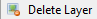
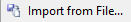

## __Creating & Removing Layers__ ##

As we have touched upon the basic concept about layers [here](concept.md), we will introduce how to create and remove layers in this section. As we know, there is an arrangement or order of layers in the Layers Window so the way you create the layers will depend on the type of work.

Layers Window:  
  

Layers Menu:  

### __Add Layer__ ###

1. Select the *Add New Layer* from the Layers Window  or from the Layers Menu .

### __Delete Layer__ ###

1. Highlight the layer to be removed from the Layers Window.
2. Select the *Delete Layer* from the Layers Window  or from the Layers Menu .

### __Duplicate Layer__ ###

1. Highlight the layer to be duplicated from the Layers Window.
2. Select the *Duplicate Layer* from the Layers Window  or from the Layers Menu .

### __Merge Layer Down__ ###

1. Order the layers using the arrow buttons  according to which layer you want to merge into the one below it by using the arrow buttons in the Layers Window.
2. Select the *Merge Layer Down* from the Layers Window  or from the Layers Menu .

### __Import File into Layer__ ###

1. Highlight the layer you want to apply the imported image into in the Layers Window.
2. Select the *Import From File...*  from the Layers Menu.
3. Choose your file and click Open to apply.
