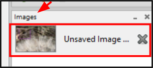
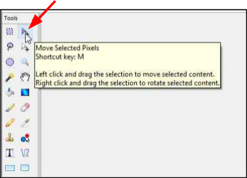
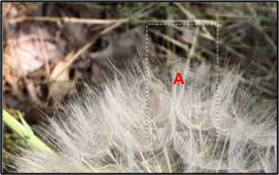
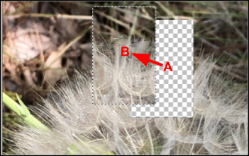

# Move Image
Use the **Move Selected Pixels** tool to move and rotate a selected portion of your image.  

1. Select an image under the **Images** window.  

       

    &nbsp; 
 
  
2. Select a portion of the image using the [magic wand](wand.md), [lasso](lasso.md), [rectangle](rectangle.md), or [ellipse](ellipse.md) tool. If no selection is active, the tool moves the entire active layer.
 
    &nbsp; 

3. Select the **Move Selected Pixels**  from the **Tools** menu.

       
 
    &nbsp;

3. Click and drag the selected image portion from its original location (example position **A**) to a new location (example position **B**). Once the pixels have been moved, an area of transparency (denoted by the grey and white checkerboard pattern) will be left in place of the moved pixels. Refer to the example below.  

      

      
 
    &nbsp;

    !!! Note 
        The checkerboard pattern indicates that the region is transparent and serves as a visual cue (not part of the visible image).

4.  Right-click and drag the selection to rotate the selected outline (Example position **C**) by the desired rotation amount.  

      
 
    &nbsp;
!!! Note 
    The right-click button always controls rotation - regardless of the location of the cursor.  
