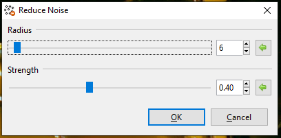
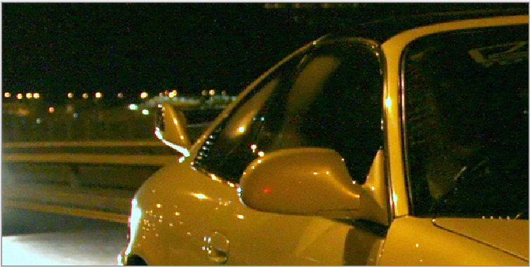
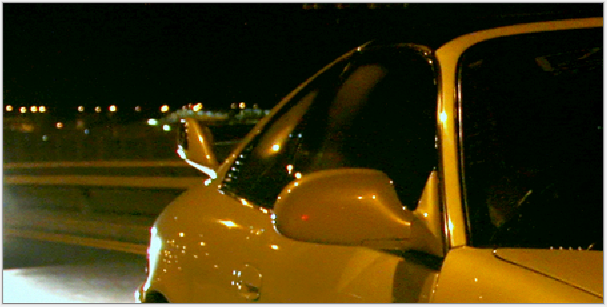

## Noise reduction ##

To access the noise reduction feature, go to **Effects > Noise > Noise Reduction**

Noise occurs in digital photographs naturally; it refers to the grainy veil in a photograph that can at times obscure details and make the picture look worse. It’s generally caused by the digital camera being unable to correctly capture details or the camera populates the noise itself, pixels not accurately representing the color or exposure. 

The **Reduce Noise** effect is used to diminish digital noise in photos. A dialogue box populates with two sliders, radius and strength.

The **Radius** slider controls how much of the image will be sampled. The sample size refers to the number of pixels that will be compared to, to see whether the pixel in question is similar or noise. 

* Drag slider to the right to increase sample size
* Drag slider to the left to decrease sample size

The **Strength** slider controls the power of the effect. A larger value will yield a stronger effect, removing more noise. A smaller value will yield less power, removing less noise.

* Drag slider to the right to increase noise removal
* Drag slider to the left to decrease noise removal

Using the reduce noise effect, we can transform this image:

Into this:

