# Creating Simple Objects

 With Pinta you can draw using a number of preset shapes and free form tools to draw simple objects. 
 
 You can draw: 

-  **Lines/Curves** 
    - [Line/curve with *Pencil* or *Brush* tools](objects.md#lines-and-curves-with-the-pencil-or-brush) 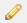 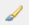
    - [Line/curve with *Form* tool](objects.md#lines-and-curves-with-a-form-tool) 
-  [**Rectangles** with *Rectangle* tool](objects.md#rectangles-rounded-rectangles-or-ellipses) 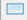 
-  [**Rounded Rectangles** with *Rounded Rectangle* tool](objects.md#rectangles-rounded-rectangles-or-ellipses) 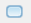
-  [**Ellipses** with *Ellipse* tool](objects.md#rectangles-rounded-rectangles-or-ellipses) 
-  [**Freeform Shapes** with *Freeform Shapes* tool](objects.md#freeform-shapes) 

&nbsp;
## Lines and Curves

### Lines and Curves with the Pencil or Brush

Before selecting a pencil or brush, it is recommended to **add a new layer** to the workpage so that it is easier to isolate/edit your pencil and brush stokes in the future.

1. [Select the *Brush* or *Pencil* tool](choose.md##How to Select a Pencil) ( or ).

2. [Select a primary color](palette.md) from the color *Palette* menu.
3. Create a starting point by clicking on the image display area with the left mouse button. 
4. Hold down the mouse button and move the cursor away from the starting point (A) to your desired end point (B)

     

### Lines and Curves With a Form Tool

The following steps explain how to draw a line using the *Line/curve* Tool. After creating a straight line, you can modify it to be a curvy line and these steps are also explained below.

1. Select the *Lines/Curve* tool from the **Tools** Menu.
2. Select the desire brush width and line style from the *Line/Curve* option menu. 
    -  **Brush width**   
            
&nbsp;    
    -  **Dash Size**: Select the top dash for a solid line otherwise select what dash pattern you would like for your line.  
        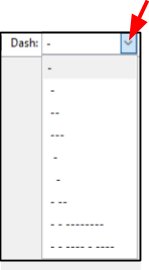    
&nbsp;  
3. Select if you would like an arrow from the *Line/curve* menu and any other arrow options.
    -  **Arrow 1 or 2**: click on 1 if you want a one way arrow and on 2 for a two way arrow. If you do not want an arrow do not click on either of these options. If you click on one of these by mistake then you can re click on them to deselect them.  
        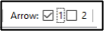    
&nbsp;    
    -  **Window Size** (pick value between 3-100): Choose the size of the arrow head. Choosing a larger number will draw a larger arrow head(s).  
        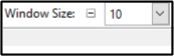    
&nbsp;  
    -  **Angle Size**: Choose an angle (between -30 to +30) for the arrow head(s). A more positive number will create a more inward angled arrow tip tail. Whereas choosing a more negative number will create a more outward angled arrow tip tall.  
             
&nbsp;      
    -  **Length**: Choose a length (between -30 to +30) for the length of arrow head(s). A more positive number will create a longer arrow head. Whereas choosing a more negative number will create a more longer arrow head pointing inwards.  
             
&nbsp;    
4. [Select a primary color](palette.md) from the color *Palette* menu.  

5. Position the cursor crosshair to the location on the screen where you want to start drawing the line/
   curve.  

6. Click and hold the mouse button and move the crosshair cursor to the end of the line/curve position.  
    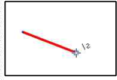 

&nbsp;  

7. Release the mouse button.  
&nbsp;

**To Curve the Line:**  

1. Position the crosshair cursor along the line in the position you would like to extend out.  
        
&nbsp;  
2. Click on the position and while holding the mouse button, drag the selected point outwards to the desired shape. Release the mouse button once the desired curve is drawn.  
    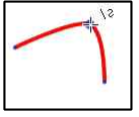      
&nbsp; 
3. Repeat the above two steps if you would like to extend out any other curves to the line.  
    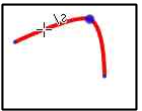 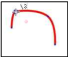  

&nbsp;   
**To make modifications after a line or curve has been created:**  
 
1. Select the *Line/curve* shape tool.  
2. Place and click the cursor crosshair on the line you wish to modify. A large dot will appear on the line at the location.  
        
&nbsp;  
3. Select and modify from the settings the brush width, dash size and  arrow.  
4. [Select a new primary color](palette.md) if you wish to change the color of the line/curve.
&nbsp;  

## Rectangles, Rounded Rectangles, or Ellipses

1. Select the preset rectangle , rounded rectangle  or ellipse  shape tool. 
2. Select the desire options from the shape option menu. 
    -  **Brush width**   
            
&nbsp;    
    -  **Dash Size**: Select the top dash for a solid line otherwise select what dash pattern you would like for your line.  
            
&nbsp;   
    -  **Fill Style**: Select one of the fill styles  
        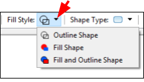    
&nbsp;    
         -  **Outline Shape**: Select if you only want the outline of the shape to be drawn.     
         -  **Fill Shape**: Select if you only want the shape to be filled with a color.  
         -  **Fill and Outline Shape**: Select if you want the shape to be outlined and filled with a color.   
&nbsp; 
    -  **Radius**: If a preset Rounded Rectangle shape tool was chosen then the radius option menu will also appear in the top menu. Select the radius size for the corners of the rounded rectangle (the larger the value chosen the more rounded the corners will be).
        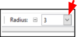   
&nbsp;  
3. [Select a primary color](palette.md) from the color *Palette* menu. The primary color will be used for the outline or the shape filled styles. If the Fill and Outline shape is chosen the primary color will be used for the outline and you will need to [select a secondary color]9Palette.md) to fill the inside of the shape.  
4. Position the cursor crosshair in your workspace where you would like the top left rectangle, rounded rectangle or ellipse corner to appear.   
5. Click and hold the mouse button while you then drag diagonallly the cursor from your initial position (**A**) to the right bottom corner location (**B**) of your desired rectangle,rounded rectangle or ellipse. The following images shows a pictorial representation of the direction to drag the cursor for a rectangle and an ellipse shape.    
  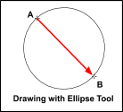   
&nbsp;    
6. Release the mouse button.  

## Freeform Shapes
The Freeform shape tool enables you to draw a shape that has both curved and straight segments.

1. Select the *Freeform* tool from the **Tools** Menu.
2. Create a starting point by clicking on the image display area with the left mouse button. 
3. Hold down the mouse button and draw the freeform shape that you wish to draw. Unlike other draw software, Pinta requires you to continuously hold down the mouse button while drawing the freeform shape which requires a very steady hand. If you are having a hard time drawing you may wish to zoom in your screen before using the draw tool for more controlled movements.
4. Release the mouse button once you have completed drawing your desired shape. If you do not end at your starting point (**A**), Pinta will default to drawing a straight line between the end point (**B**) and start point of the closed shape (refer to Draw Freeform Shape Example diagram below). 

    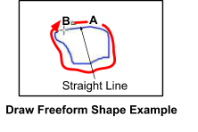

