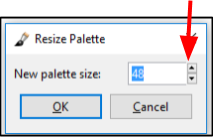

# Creating Palette

Pinta comes with a default palette of 48 Colors that you can use to quickly select when picking a color.

 To change the number of colors on the palette, save your customized palette, open a save palette or save a palette:

1.  Go to the *Edit Menu* and select **Palette**.

     
 

&nbsp;  
2.  From the **Palette** Submenu you can select: 

  -  **Open...**: Use to open an existing saved Palette
  -  **Save As...**: Use to save your Palette
  -  **Reset to Default**:  Use to restore your Palette back to the default setting of 48 colors.
  -  **Set Number of Colors**: Use to adjust the number of colors in the Palette. When selected the **Resize Palette** Window will appear and you can choose to have between 1-48 colors. 

    

