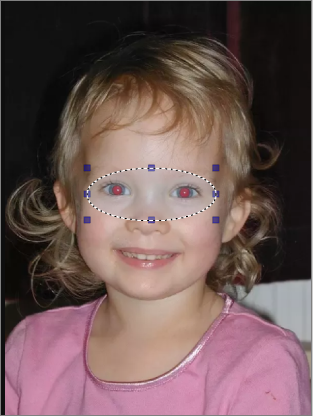
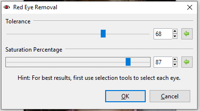

## Reduce red-eye ##

To access the red-eye removal feature, go to **Effects > Photo > Red Eye Removal**

The **Red eye removal** function recolors the red eyes caused by flash photography. 

Here's our subject, suffering a chronic case of red eye caused by flash. 

* To confine the effect to just the eyes, use the selection tool to highlight the subject’s eyes. 

A dialogue box with a ‘strength’ slider will appear, the strength determines the amount of color replaced. A higher value yields a  stronger the recoloring of the eyes.

* Drag slider to the right to increase recoloring strength
* Drag slider to the left to decrease recoloring strength 

