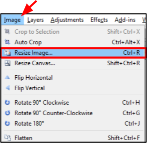

# Resize 

1.  Select the image to resize from the **Image** window.

       

    &nbsp; 
 
  
2. Go to the **Image** menu and select **Resize Canvas**.

        

     The **Resize Image** menu will appear on your screen.  
&nbsp;

3. Select the method you would like to resize your image:

     -  **By Percentage**: Select to resize the image by a percentage value.  This will resize the image while keeping the aspect ratio the same.
     &nbsp;  

     -  **By Absolute Size**: Select this to resize the image by a custom width and height size. To maintain the original aspect ratio of your image, select **Maintain Aspect Ratio** before entering in the **Width** and **Height** in pixels.   

            
&nbsp;
   
4. Click **OK** when completed and your image will be resized to the amount you have specified.  
 
