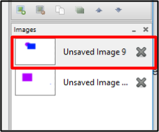
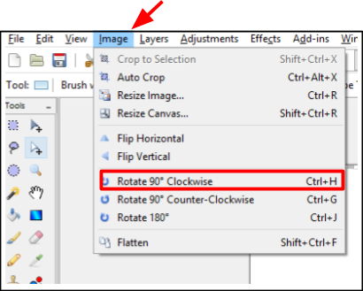
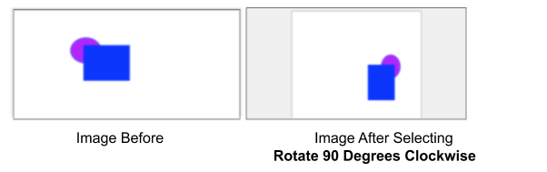

# Rotate

 You can rotate an image by using:  

 -  [**Rotate Image Preset Degrees**](rotate.md#rotate_image_preset_degrees): Use to rotate an image in a layer 90 or 180 degrees.
 -  [**Rotate Layer Specified Degrees**](rotate.md#rotate_layer_specified_degrees): Use to rotate an image a specific amount of degrees.
 -  [**Rotate using Move Selection Tool**](move.md): Use this to move a selected portion of an image. 

## Rotate Image Preset Degrees

1. Select the image you want to rotate from the *Images Window*.  

       

    &nbsp; 
 
  
2. Go to the *Image Menu* and select one of the preset rotations.

       

    - **Rotate 90 degrees Clockwise**
    - **Rotate 90 degrees Counter-Clockwise**
    - **Rotate 180 degrees**    
&nbsp;

    The following example shows what would happen if Rotate 90 degrees Clockwise was selected:

      

3. Check that the image has rotated after selecting a preset rotation. If you would like to unrotate the image use the [undo function](concept.md). 

## Rotate Layer Specified Degrees

1.  Select the layer that you would like to rotate from the *Layer Window*.

       

    &nbsp; 
 
  
2. Go to the *Layer Menu* and select **Layer Properties**.

       

     The Rotate/Zoom Layer menu will then appear on your screen.  
&nbsp;

3. From the **Rotate/Zoom Layer** Menu:  

    1. Select the amount of degrees that you would like to rotate the layer from the Rotate/Zoom Layer window with any of the following methods:
        -  Click the dial stick and hold the mouse button while using the cursor to move the dial stick until you set the desire degrees
        -  Enter in the degrees number setting directly in the degrees box by typing in the degree value
        -  Enter in the degrees number by using the up and down arrows of the degrees box
    
      

    &nbsp;
    2. Click **OK** when the degree amount is the desired value.  

    The following example shows what would happen if Rotate 127 degrees was selected:

    
##  Rotate Using The Move Selection Tool

    If you only want to rotate a portion of an image you can use the *Move Selected Pixels* tool.
    
    For step by step instructions go to the [**Image Transformations>Move**](move.md) section of this guide.

    
