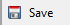
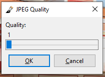

## Save Project ##

### Save vs Save As: ###
Pinta has two save options a quick save and a save as function.

To **Quick Save** you can use the (`CTRL` + `S`) shortcut or click on *Save*  under the File menu. All images are automatically saved as JPEGs. A dialogue box will populate with a slider for JPEG Quality, with one being the lowest possible quality and 100 being the highest possible quality.

* Drag slider to the right to increase JPEG quality
* Drag slider to the left to decrease JPEG quality

For the more advanced **Save As** function, you can use the (`CTRL` + `SHIFT` + `S`) shortcut or click on *Save As...*  under the File menu. An advanced dialogue box will populate where you can name the file, select file type, and select the directory. 

1. Click on *Save As...*  under the File menu.
2. Select the directory to save the project in.
3. Select "OpenRaster image (*.ora, *.ORA)" under the bottom drop-down list.
4. Click Save to save the new project.

Once you hit save, a second dialogue box will populate with a slider for JPEG Quality, with one being the lowest possible quality and 100 being the highest possible quality. 

* Drag slider to the right to increase JPEG quality
* Drag slider to the left to decrease JPEG quality

### Exporting your project ###

Pinta allows you to export your project in a number of different formats:

Format | Extension | Use 
:-----------:|:-------------------------:|:------------
**PNG Image**| .png .PNG | lossless compression file format, good choice for storing line drawings, text, and iconic graphics at a small file size.
**BMP Image**| .bmp .BMP | an uncompressed raster image comprised of a rectangular grid of pixels, containing a file header (bitmap identifier, file size, width, height, color options, and bitmap data starting point) and bitmap pixels, each with a different color.
**ICO Image**| .ico .ICO | contains an icon, which is typically used for a Windows program, file, or folder. It stores one or more images in various sizes so they can be appropriately scaled depending on their use.
**JPEG Image**| .jpg .jpeg .JPG .JPEG | lossy compressed file format, useful for storing photographs at a smaller size than a BMP. Common choice for use on the Web because it is compressed.
**TIFF Image**| .tif .tiff .TIF .TIFF | lossless compression file format, often used for storing images with many colors, typically digital photos, and includes support for layers and multiple pages.
**TGA Image**| .tga .TGA | a file saved in the raster graphic format designed by Truevision. It supports 8, 16, 24, or 32 bits per pixel at a maximum of 24 bits for RGB colors and 8-bit alpha channel. Used for various types of images, such as digital photos and textures referenced by 3D video games.
**OpenRaster Image**| .ora .ORA | a file saved in the OpenRaster format, and open raster graphics format that supports multiple layers; supports multiple layers and contains both image data and metadata, including XMP and EXIF tags.

____________________________________________________________________________________________________________
###### Extension uses taken from https://fileinfo.com/ ######
