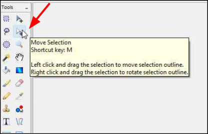
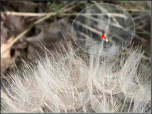
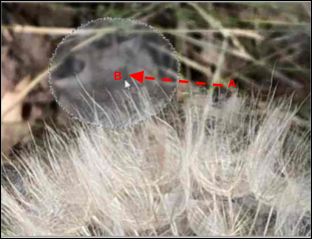
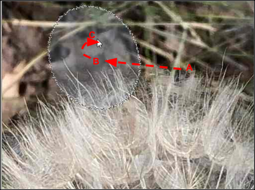

# Move Selection Location
Using the *Move Selection* Tool you can move and rotate the selected outline. This tool does not change any pixels on the active layer and only affects the location of the selected outline.

After selecting a portion of the image using the [lasso](lasso.md), [rectangle](rectangle.md) or [ellipse](ellipse.md) tools perform the following steps:

1.  Select the *Move Selection* Tool  from the **Tools** Menu.

       
 
    &nbsp;

2.  Left Click the mouse and hold the button down while you drag the selected outline from the starting location (Position **A**) to the desired position (Position **B**).

     
 
    &nbsp;

3.  Right Click the mouse and hold and use the mouse to rotate the selected outline if desired (Position **C**). 

 
      

    !!! Note 
        The Right Mouse button always accesses rotation - regardless of the location of the cursor.

4.  Release the mouse button when the selected outline is in the desired location and orientation. 
