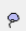
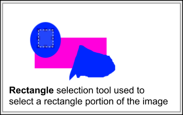
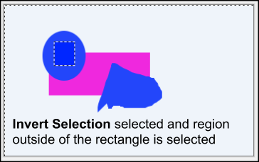

# Select Objects Overview
Pinta provides a number of **Selection Tools** and **Select All Options** to select images.

## Selection Tools

Using a selection *Tool* you can isolate a specific area and make modifications to one or more objects within an image. You can then edit and apply effects to the selected portion of the image while leaving the unselected areas unchanged. 

Pinta provides the following selection *Tools*:

  - [**Magic Wand**](wand.md) : Use to select a colored area or similar colored areas (for example, the blue portion of an image) without having to trace an outline. You can specify the selected color range (tolerance), relative to the original color you click.
  - [**Lasso**](lasso.md) :  Use to select a freeform border shaped portion of an image.
  - [**Ellipse**](ellipse.md) :  Use to select an ellipse portion of an image.
  - [**Rectangle**](rectangle.md) : Use to select a rectangular portion of an image.
  - [**Move Selection**](select_location.md) : Use to change the selected outline location (position and orientation) that is created from one of the above selection tools.

## Select All Options

In addition to the above selection tools, Pinta also provides the capability to perform a number selection tasks on all pixels on an active layer:

   - **Select All**: Selects an entire active layer
   - **Deselect All**: Deselects all pixels in the active window that were selected whether all the pixels were originally selected or just a particular portion of the image was selected. 
   - **Invert Selection**: All the active pixels that are selected will be deselected and all the pixels that were not selected will become selected  

To perform these selection options:

1.  Go to **Edit>Select All**, **Edit>Deselect All** or **Edit>Invert Selection**.  

     

  After using the  **Select All** a dotted line selection encompases the outter edge of the whole image. Now you can perform image transformations (such as [rotate](rotate.md), [flip](flip.md), [resize](resize.md) and [crop](crop.md)) to all parts of the image at the same time or [remove all items](remove_items.md).
  
  If **Deselect All** is selected all pixels are deselected and all the dotted line selections will no longer appear on the image. 

  If you originally had selected a rectangle portion of the image and you select **Invert Selection** everything except the rectangle portion would be selected as can be seen in the example below.   

  

  

