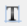
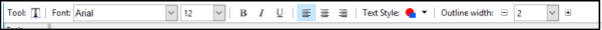
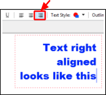
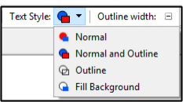
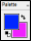
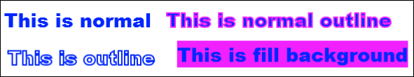

# Text Management #

 Pinta enables you to add some basic monochrome, uniformly formatted text to your images. Text can be shown with or without an outline. Advanced functions like aligning text images, editing text after you move away from it, or moving text from one layer to another are not included.  

 Pinta’s text tool does not automatically make a layer of its own in the workspace. As a result, it is recommended to first create a new layer before adding text as it will be easier to remove the text if desired in the future.

## How to Add Text

 
 1. Select the *Text Tool*  from the Tool Menu options.   

       

    After the *Text Tool* is selected, the Text Tool bar should appear on the top menu.

     

    &nbsp; 
 

  
2. Select the desire font, font size, font style, text justification, text style and text outline width  from the *Text Tool* bar menu options.

    -  **Font & Font Size**: Select the desired font and font size (6-96) from the font and font size drop-down lists.    
    -  **Bold, Italic, Underline**: Select the desired font style.   
    -  **Text Justification**: If you intend to have multiple lines of text, select left, centre or right text justification to align text within a text box. With only one line of text the selection of this option will have no effect.

           

        &nbsp;    

    -  **Text Style**: Select one of the four options from the Text Style pulldown menu.    

        

          - **Normal**: Text characters are colored with the primary color.  
          - **Normal and Outline**: Text character is colored with the primary color and the character outline is colored using the secondary color.
          - **Outline**: Text characters outline is only visible. The outline uses the  primarly color.
          - **Fill Background**: Text characters are colored with the primary color. The background of the area surrounding the text within the text box is colored using the secondary color. 
          
              Text style output with blue primary and pink secondary colors chosen: 

               
            &nbsp;    
   
    -  **Outline Width:** If you selected the **Normal and Outline** or the **Outline** text styles, the outline width will determine the pixel width of the outline color of the text characters (1-55)   

 

