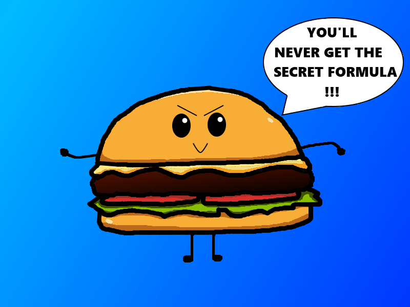
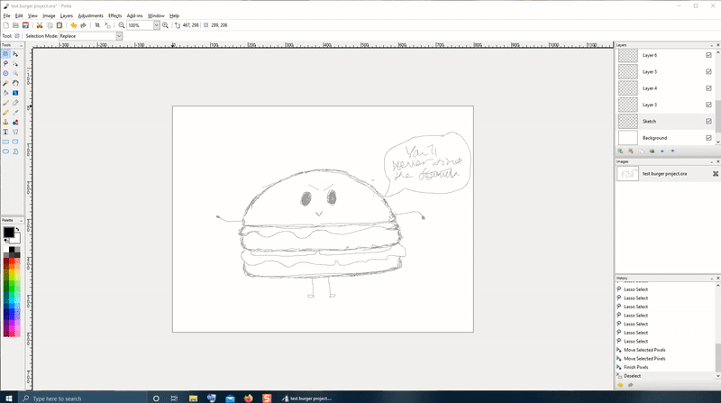
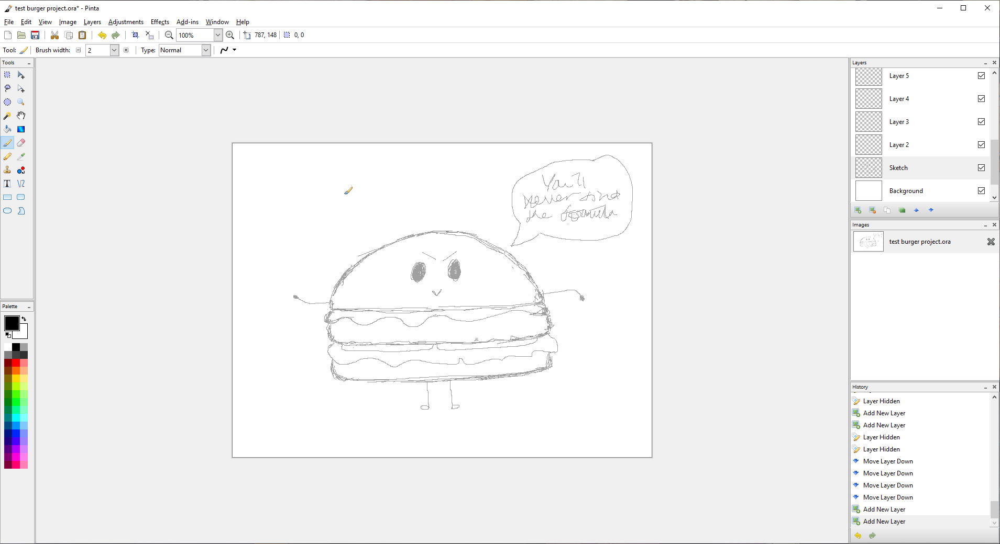
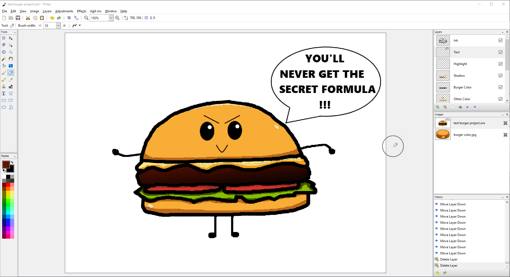
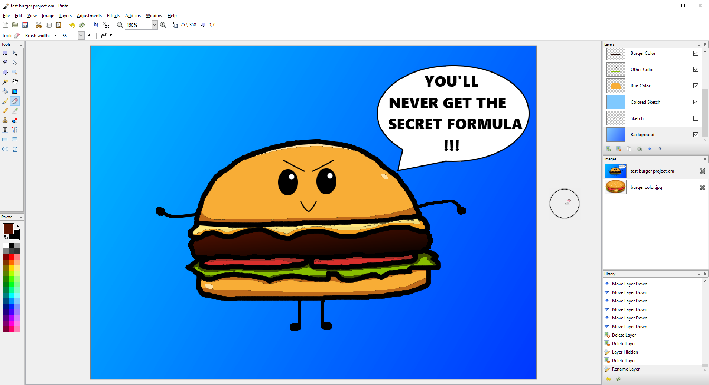

# __Tutorial__ #

!!! Note
    Before we begin, please make sure you have setup and understood your workspace. If you have trouble setting up or understanding how to start, go back to [Setting Up Workspace](setup.md) for a quick workspace guide.

In this tutorial, we will learn how to create our first project - a final image. These key ingredients will help us achieve our goal:

- Working with layers.
- Making selections.
- Penciling and painting.
- Working with color.
- Adding text and shapes.
- And utilizing various common tools.  

By the end of this tutorial, we will create this little secret burger:

Although this is a tutorial on creating a graphic image, this is not a drawing tutorial so we cannot guarantee if your drawing will look *exactly* as our image. If you haven't setup your workspace yet, it is highly recommended because this tutorial will assume the workspace has been configured. See [Setting Up Workspace](setup.md) to learn more. 

To keep the images consistent, we'll be drawing a very basic burger. It should have at least a top bun, a bottom bun, cheese, a patty, tomatoes and lettuce. This tutorial can take at least 2-3 hours to complete for some new users to Pinta.  So if you need to rearrange your time, this is the moment. Some may find that by doing this project, they're able to quickly learn the various capabilities Pinta has to offer. Alternatively, if you don't have the time to do this tutorial, you can look up topics of interest in the user manual to suit your specific image editing needs.

## __Sketching__ ##
The tools we'll use for sketching are:  

- Pencil  
- Eraser 
- Lasso Select 
- Shapes  
- Lines  
- Text

Now we can get started on sketching our little secret burger! Using the default canvas layout: 

1. Select __Add Layer__  to add a new layer in the __Layers__ window.
2. Select Layer 2 from the [**Layers** window](overview.md#layers_window). Make sure the __Background__ layer is *below* the new layer (use the up and down arrows  on the **Layers** window to rearrange layers if necessary). 
3. Double-click the layer to open __Layer Properties__ dialog box and type __Sketch__ for the name of the layer. 
4. Select __OK__ to close the window. 
5. Select __Sketch__ to make it an active layer. 
6. Select [__Pencil__](choose.md#how-to-select-a-pencil) to start sketching your burger. 
    - Use [__Eraser__ to remove](remove_items.md#remove-item-with-eraser-tool) any markings not needed. 
    - Change the eraser size as needed in the *Tools Settings Bar*. 
    - Use any [__Selection__](select_overview.md) tool to move any sketches around. In this case, we used the __Lasso Select__ to move the text box up higher. 
    
    - Use [__Shapes__, __Lines__](objects.md) and [__Text__](text.md) to help create your sketch if that is your preference. 
    - You can also upload a hand-drawn sketch as well. Go to [Import File into Layer](setup.md#import-file-into-layer) to learn more.     
7. Go to __File__ > __Save As...__ to save your progress as a [project *.ora file](setup.md#saving-the-new-project) and it should look something like this:   
  

Before we move on to inking over the sketch, we want to change the color of the pencil sketch so that it's easier to see between the (black) inking and the (black) sketch itself. Blue would be a nice color to see through, but use whatever color you prefer.

1. Create a new layer. Make sure this new layer is *above* __Sketch__ layer.
2. Open __Layer Properties__ dialog box for the new layer and enter __Color Sketch__ in the text box.
3. Select [__Color Burn__](edit.md#color-burn) under the [__Blend Mode__](edit.md#apply-blend-mode) drop-down list and select __OK__. 
4. Select __Color Burn__ to make it an active layer. 
5. [Select __Paint Bucket__ tool](coloringarea.md) and choose a [__Palette__](palette.md) color. 
6. Click on the project to apply the color on the __Color Burn__ layer. 
7. Save  your progress and it should look like this: 

As you can see from the thumbnail in the __Layers__ window, the [__Color Burn__](edit.md#color-burn) layer is fully colored in but from the drawing, it only burned in the color onto the pencil sketch itself. This can only work when the layers are [stacked](concept.md#layers) accordingly and [properties](edit.md) of the layers are modified. Otherwise, the color would just lay on top of the sketch layer, completely covering it in its [normal](edit.md#normal) state.

## __Inking__ ##
The tools we'll use for inking are:  

- Pencil  
- Eraser 
- Shapes  
- Lines

This part of the process, we'll be inking the rough sketch itself so that all the lines needed are more distinct.

1. Create a new layer in the __Layers__ window. Make sure this new layer is *above* __Color Sketch__ layer. 
2. Open __Layer Properties__ dialog box for the new layer and enter __Ink__ in the text box. 
3. Select __OK__ to close the window.  
4. Select __Ink__ to make it an active layer. 
5. [Select __Paintbrush__](choose.md#how-to-select-a-brush) to start inking over your rough sketches. 
    - Same as with sketching, use __Eraser__ to remove any markings not needed. 
    - Use __Shapes__ and __Lines__ to help create your objects if needed, but we will skip on the __Text__ tool for a later step.
6. Save your progress and it should look something like this:  

## __Coloring__ ##
The tools we'll use for coloring are:  

- Burger image reference  
- Palette  
- Color Picker  
- Paintbrush  
- Eraser  
- Gradient  

This is now the fun part: coloring! For the purposes of this tutorial, we also added in this burger image for you to download as a color image reference for when we pick colors. Go ahead and right-click on the image to save the image down below:  
  

### __Bun__ ###
Now let's begin with the bun:

1. Uncheck the box for __Sketch__ in the __Layers__ window to [hide the layer](edit.md#hide/unhide-layers) from view. We won't be needing it for this process.
2. Create a new layer. Make sure this new layer is *below* __Ink__ layer. 
3. Double-click the new layer to open __Layer Properties__ dialog box and under the name type __Bun Color__. 
4. Select __OK__ to close the window.  
5. Select __Bun Color__ to make it an active layer. 
6. Go to __File__ > __Open...__ and open the saved burger image reference.
7. Select [__Color Picker__](coloring.md#select-an-exact-color-match-from-an-image) to pick the bun color from the reference image and switch back to the burger project under the __Image__ window. You can create and modify your own color by double-clicking on the primary or secondary color boxes under [__Palette__](palette.md).
8. Select __Paintbrush__ to color in the entire burger. You can enlarge the size of the __Paintbrush__ in the __Tools Settings Bar__ to speed up the process.
9. Select [__Eraser__](remove_items.md#remove-item-with-eraser-tool) to clean up any color that doesn't belong. 
10. Save your progress and it should look something like this: 

### __Cheese, Tomatoes & Lettuce__ ###
We'll now work on the cheese, tomatoes, and lettuce:

1. Create a new layer. Make sure this new layer is *below* __Ink__ and *above* __Bun Color__ layers.
2. Open __Layer Properties__ dialog box for the new layer and enter __Other Color__ in the text box. 
3. Select __OK__ to close the window. 
4. Select __Other Color__ to make it an active layer. 
5. Using the same concept as the bun, select __Color Picker__ to pick the colors from the reference image to apply to the project for the cheese, tomatoes, and lettuce. 
6. Select __Paintbrush__ and __Eraser__ to color in the appropriate areas. 
7. Save your progress and it should look like this: 

### __Patty__ ###
For the patty, we want to create a gradient to replicate the grilled side of the patty:

1. Create a new layer. Make sure this new layer is *below* __Ink__ and *above* __Other Color__ layers.
2. Open __Layer Properties__ for the new layer, enter __Patty Color__, and enter an **Opacity** value of 90. 
3. Select __OK__ to close the window. 
4. Select __Patty Color__ to make it an active layer. 
5. Using the same concept as earlier, select __Color Picker__ to pick the patty color from the reference image and switch back to the project. 
6. Right-click the black color in the __Palette__ to set the secondary color and select __Gradient__. 
7. Click and hold on the drawing in any area while moving the cursor in different directions to form a gradient. Let go once you're satisfied with the way the color is distributed. Repeat if necessary.
8. Select __Eraser__ to erase anything that is outside of the patty. Resize __Eraser__ to get the required size.
9. Double-click on __Patty Color__ in the **Layers** window and enter **Opacity** value of 100. Select __OK__ to close the window. 
10. Save your progress and the whole process should look like this: 

### __Shadows and Highlights__ ###
This area is optional so you can skip to the [next section](#adding-texts-&-shapes) if you want. Now let's add some dimension by adding shadows and highlights to the burger:

1. Create a new layer called __Shadows__ and another called __Highlights__. Make sure both layers are *below* __Ink__ and *above* __Patty Color__ layers.
2. Select the corresponding active layer to apply shadows and highlights.
3. Select __Color Picker__ to pick the bun color (or cheese, tomatoes, lettuce).
4. Double-click the primary color in the __Palette__ and modify the color to a lighter color for __Highlights__ and repeat with the darker color for __Shadows__. Click __OK__ to close the window.
5. Select __Paintbrush__ and __Eraser__ to color in the appropriate areas. Resize the two tools to a smaller size for precision.
6. Save your progress.

## __Adding Texts & Shapes__ ##
The tools we'll use for adding texts and shapes are:  
 
- Shapes 
- Lines 
- Texts  
- Eraser

From here, we can start to add these elements against the sketch layer again.
  
1. Create a new layer. Make sure this new layer is *below* __Ink__ layer.
2. Check the box for __Sketch__ in the __Layers__ window to [unhide](edit.md#hide/unhide-layers) the sketch.
3. Select [__Ellipse__](objects.md) and select [__Line__](objects.md) to create a speech bubble over the sketched speech bubble.
4. Select [__Eraser__](remove_items.md#remove-item-with-eraser-tool) to erase a part of the ellipse that's connected to the lines to complete the speech bubble.
5. Select [__Text__](text.md) and modify the font in the *Tools Settings Bar*.
6. Click inside the speech bubble to create a line of text.
    - __Text__ can only be modified before you place it on the drawing so use the __History__ window to track where you want to [__Undo and Redo__](setup.md#using-undo-or-redo-functions) your actions.
    - __Text__ can be done line by line so you will need to play around with __Undo__ and __Redo__ until you position your text where you want it to be.
8. Uncheck the box for __Sketch__ to hide the sketch as we'll no longer need the sketch layer to view.
9. Save your progress and it should look something like this: 

## __Finished Image__ ##

Your little secret burger is now complete! You can change the __Background__ layer to whatever color you want. Just make sure you select it as an active layer before you begin. What we did here was apply a primary blue with secondary light-blue gradient.  

You can now [__Save__](save.md) your image as any image file format besides [.ORA](setup.md#saving-the-new-project) and use it externally now.
