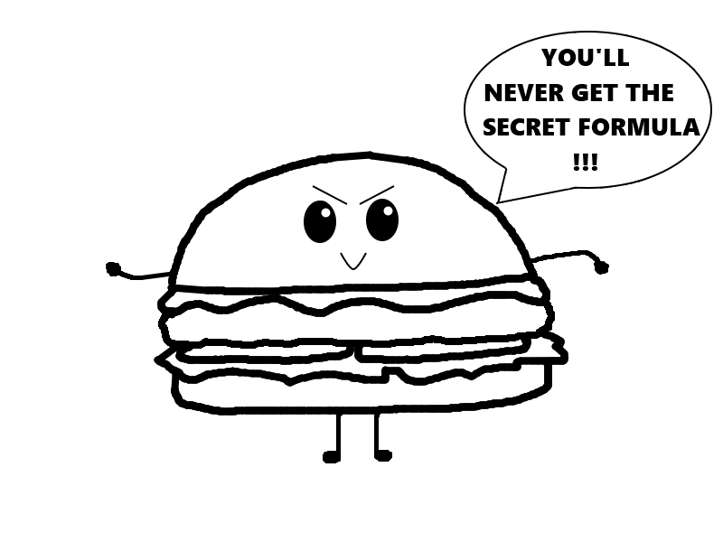
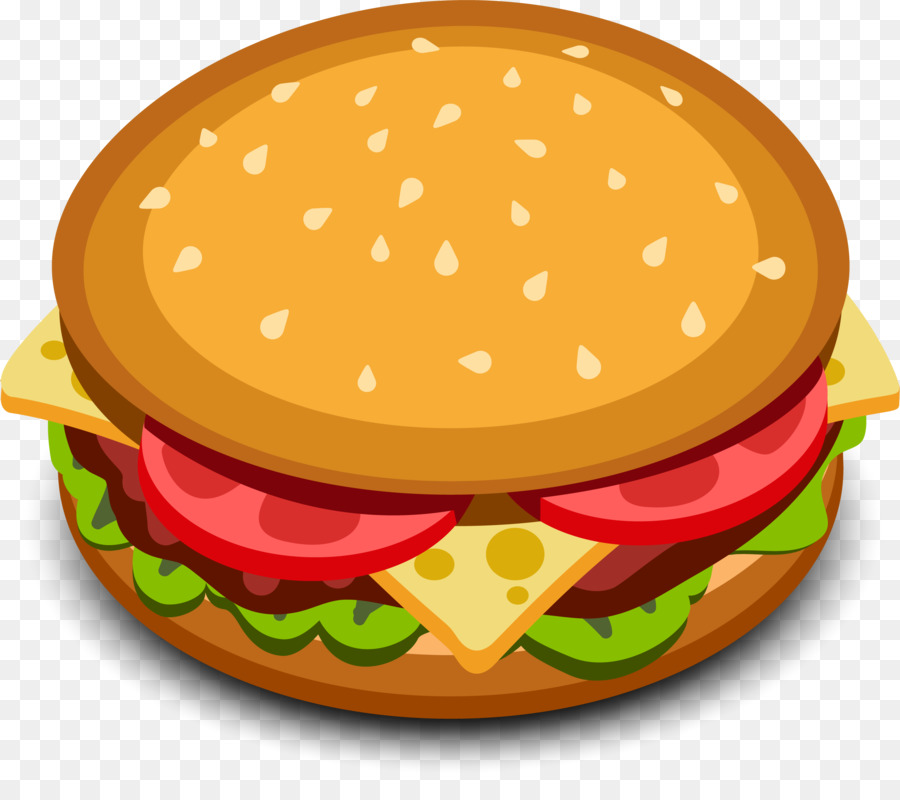

## __Tutorial__ ##

In this tutorial, we will learn how to create a final image by using these key ingredients and techniques:

- Working with layers;
- Making selections;
- Sketching and painting;
- Working with color;
- Adding text and shapes;
- And utilizing various common tools. 

By the end of this tutorial, we will create this little secret burger:

### Layering ###

### Sketching ###

### Inking ###

### Coloring ###

### Adding Texts and Shapes ###

### Finished Image ###

