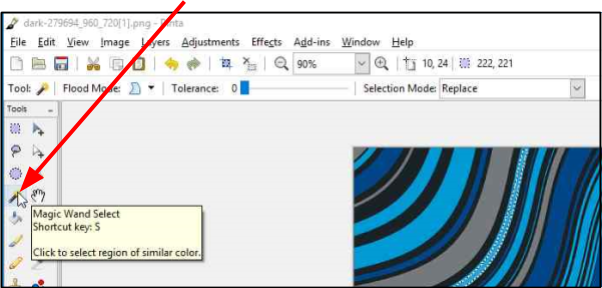
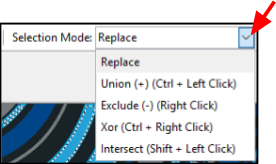

# Magic Wand

The **Magic Wand Select** tool is ideal for when you want to select a similar colour section of an image without having to trace its outline. Unlike other selection tools that select pixels based on shapes ([Lasso](lasso.md), [Ellipse](ellipse.md), or [Rectangle](rectangle.md) tools) the **Magic Wand** selects pixels based on color. For example, you might want to change a particular blue section or all the blue sections in an image to a different colour. The region selected may be a single continuous shape or multiple separate areas.

## How to Use Magic Wand 

1. Select **Magic Wand**  from the **Tools** menu.   

       

    &nbsp; 
  
2.  Move the **Tolerance** slider to the desired level (0-100). A higher selected tolerance (color range), will encompass a higher relative spectrum of colors, compared to the original color you chose.  
      

    &nbsp;

3. Go to **Selection Mode** in the *Tools Settings Bar* and select a mode. You can use shortcuts to temporarily switch between them. 

      

    - **Replace**: Newly created selection cue will replace the existing one (this is the default mode).
    - **Union**: Newly selected regions will be added to the existing selection.
    - **Exclude**: Clicking inside an existing selection removes an area from the selection, depending on currently set tolerance level.
    - **Xor**: Selects areas around existing selection when you click inside it.
    - **Intersect**: Clicking inside an existing selection replaces it with selection under the cursor, depending on the current tolerance level.

    &nbsp;

4. Go to **Flood Mode** and select either **Contiguous** or **Global**.  
    
 
    - **Contiguous**: Choose this option to select all parts of the image with the similar color that's touching the selected portion. 
    - **Global**: Choose this option to select all parts of the image with the similar color (within the tolerance level) regardless of whether they are touching the selected portion or not.
    
    &nbsp;

5. Hover the **Magic Wand** and click over the color region to select the region.

    **Example: Magic Wand with Contiguous Option Selected**

     

    &nbsp;

    **Example: Magic Wand with Global Option Selected**

    
